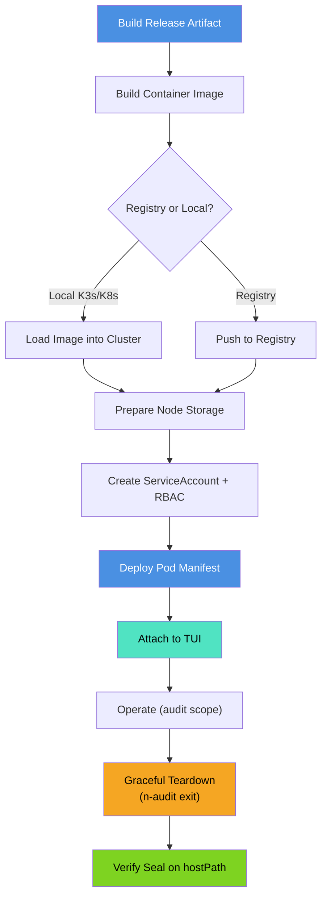

# Deployment Guide

Complete instructions for deploying N-Audit Sentinel on Kubernetes (K3s, K8s, or managed clusters with Cilium).

## Deployment Pipeline



## Prerequisites

**Kubernetes & Networking:**
- Kubernetes cluster (K3s, K8s, EKS, GKE, AKS, etc.) with **Cilium CNI** enabled
- Cilium must support `CiliumNetworkPolicy` CRD (v1.10+)
- `kubectl` CLI tool with cluster access

**Container Infrastructure:**
- Container build tool: `docker`, `podman`, or `nerdctl`
- Access to container registry (Docker Hub, local registry, etc.) OR local image loading for K3s/K8s

**Node Configuration:**
- Node with writable path for persistent logs: `/mnt/n-audit-data`
- Sufficient disk space for audit session logs (typically MB to GB per session)
- SSH key storage location: `/mnt/n-audit-data/signing/`

**Optional:**
- Terraform 1.0+ (for automated end-to-end deployment with `deploy/terraform/`)
- jq (for JSON parsing in automation)

## Step 1: Build or Import Container Image

### Option A: Local Build (K3s/K8s)

**Build and load image into local cluster:**

```bash
# From repository root
make release VERSION=v1.0.0-Beta

# Navigate to Dockerfile location
cd beta-test-deployment

# Build image
docker build -t n-audit-sentinel:v1.0.0-Beta .

# Load into K3s containerd (K3s example)
docker save n-audit-sentinel:v1.0.0-Beta | \
  sudo k3s ctr images import -

# Or for standard K8s with Docker
kubectl load image n-audit-sentinel:v1.0.0-Beta \
  --node=<node-name>  # if using image import
```

### Option B: Registry-Based (Production)

**Push to Docker Hub or private registry:**

```bash
# Build for registry
docker build -t your-registry/n-audit-sentinel:v1.0.0-Beta .

# Login and push
docker login
docker push your-registry/n-audit-sentinel:v1.0.0-Beta

# Update pod manifest to use registry image
# (change `image:` field in pod YAML)
```

### Option C: Terraform-Driven (Recommended for Production)

**Automated end-to-end deployment:**

```bash
cd deploy/terraform
terraform init
terraform plan \
  -var="namespace=default" \
  -var="image_name=n-audit-sentinel" \
  -var="image_tag=v1.0.0-Beta"
terraform apply -auto-approve
```

Terraform handles:
- Pod creation with correct labels (`app: n-audit-sentinel`)
- ServiceAccount and RBAC bindings
- Volume mounts and hostPath configuration
- Environment variables

Customization via variables (see `deploy/terraform/variables.tf`):
- `namespace` — Kubernetes namespace
- `image_name` — Container image name
- `image_tag` — Image tag/version
- `storage_class` — Use PVC instead of hostPath (optional)

## Step 2: Prepare Node Storage and Signing Key

### Create hostPath directories

```bash
# Create storage directory with signing subdirectory
sudo mkdir -p /mnt/n-audit-data/signing

# Set permissions (directory accessible to pod)
sudo chmod 755 /mnt/n-audit-data
sudo chmod 755 /mnt/n-audit-data/signing
```

### Generate Ed25519 signing key

```bash
# Generate SSH key pair (no passphrase for automated signing)
sudo ssh-keygen \
  -t ed25519 \
  -N "" \
  -f /mnt/n-audit-data/signing/id_ed25519 \
  -C "n-audit-sentinel@$(hostname)"

# Secure key file
sudo chmod 600 /mnt/n-audit-data/signing/id_ed25519
sudo chmod 644 /mnt/n-audit-data/signing/id_ed25519.pub

# Verify
sudo ls -la /mnt/n-audit-data/signing/
# Expected:
# -rw------- id_ed25519     (private key, 600)
# -rw-r--r-- id_ed25519.pub (public key, 644)
```

**Important:** Keep the private key secure. Store backups in a secure location.

## Step 3: Create ServiceAccount and RBAC

N-Audit Sentinel requires a ServiceAccount with permissions to create, read, and delete `CiliumNetworkPolicy` resources.

### Apply RBAC manifests

**Option A: Use provided manifests (recommended)**

```bash
# Apply all-in-one ServiceAccount + RBAC
kubectl apply -f beta-test-deployment/serviceaccount.yaml

# Verify
kubectl get serviceaccount n-audit-sentinel
kubectl get clusterrole n-audit-cilium-policy
kubectl get clusterrolebinding n-audit-cilium-policy
```

**Option B: Apply inline YAML**

```bash
kubectl apply -f - <<'EOF'
apiVersion: v1
kind: ServiceAccount
metadata:
  name: n-audit-sentinel
  namespace: default
---
apiVersion: rbac.authorization.k8s.io/v1
kind: ClusterRole
metadata:
  name: n-audit-cilium-policy
rules:
- apiGroups: ["cilium.io"]
  resources: ["ciliumnetworkpolicies"]
  verbs: ["get", "list", "create", "delete", "update", "patch"]
---
apiVersion: rbac.authorization.k8s.io/v1
kind: ClusterRoleBinding
metadata:
  name: n-audit-cilium-policy
roleRef:
  apiGroup: rbac.authorization.k8s.io
  kind: ClusterRole
  name: n-audit-cilium-policy
subjects:
- kind: ServiceAccount
  name: n-audit-sentinel
  namespace: default
EOF
```

### Verify permissions

```bash
# Check ServiceAccount was created
kubectl get sa n-audit-sentinel -o yaml

# Check RBAC bindings
kubectl auth can-i create ciliumnetworkpolicies \
  --as=system:serviceaccount:default:n-audit-sentinel
# Expected output: yes
```

## Step 4: Deploy Pod Manifest

Apply the pod manifest with correct ServiceAccount, volume mounts, and environment variables.
```yaml
apiVersion: v1
kind: Pod
metadata:
  name: n-audit-sentinel
  labels:
    app: n-audit-sentinel
spec:
  serviceAccountName: n-audit-sentinel
  securityContext:
    runAsUser: 0
  containers:
  - name: sentinel
    image: n-audit-sentinel:v1.0.0-Beta
    stdin: true
    tty: true
    env:
    - name: SSH_SIGN_KEY_PATH
      value: "/var/lib/n-audit/signing/id_ed25519"
    volumeMounts:
    - name: data
      mountPath: /var/lib/n-audit
  volumes:
  - name: data
    hostPath:
      path: /mnt/n-audit-data
      type: DirectoryOrCreate
  restartPolicy: Always
```

**Apply the manifest:**

```bash
# Option A: Save to file and apply
cat > pod.yaml <<'EOF'
# [paste YAML above]
EOF
kubectl apply -f pod.yaml

# Option B: Apply directly
kubectl apply -f beta-test-deployment/pod-fixed.yaml
```

**Verify pod is running:**

```bash
kubectl get pods n-audit-sentinel
kubectl describe pod n-audit-sentinel
```

## Step 5: Attach and Operate

### Start an Audit Session

```bash
kubectl attach -it n-audit-sentinel -c sentinel
```

**Follow TUI Prompts:**
1. Enter Pentester name
2. Enter Client name
3. Enter Layer 3 scope (IP/CIDR) — use double-Enter when done
4. Enter Layer 7 scope (Domains) — use double-Enter when done

**Inside the Shell:**
Execute your audit commands. All activity is logged with:
- ANSI codes stripped for clean logging
- Per-line timestamps in `YYYY-MM-DD HH:MM:SS` format
- Real-time writes to `/var/lib/n-audit/session.log`

### End the Session Gracefully

**From another terminal:**
```bash
kubectl exec n-audit-sentinel -c sentinel -- /usr/local/bin/n-audit
```

This sends SIGUSR1 to PID 1, triggering:
1. Log closure
2. SHA256 computation
3. SSH cryptographic signature
4. FORENSIC SEAL appended to log
5. Cilium policy cleanup
6. Pod exit

## Step 6: Verify Logs and Seal

### Access Session Log

**From pod:**
```bash
kubectl exec -it n-audit-sentinel -- tail -f /var/lib/n-audit/session.log
```

**From host (via hostPath):**
```bash
sudo tail -f /mnt/n-audit-data/session.log
```

### Validate Log Integrity

**Check for FORENSIC SEAL block:**
```bash
sudo tail -20 /mnt/n-audit-data/session.log
# Expected:
# === FORENSIC SEAL ===
# SHA256 Hash: <64-char hex string>
# SSH Signature (Base64): <base64 string>
# =====================
```

**Verify SHA256:**
```bash
# Extract seal block and exclude it from hash
awk '/^=== FORENSIC SEAL ===/{exit} {print}' /mnt/n-audit-data/session.log | sha256sum

# Compare with seal value
grep "SHA256 Hash:" /mnt/n-audit-data/session.log
```

## Troubleshooting

| Issue | Root Cause | Solution |
|-------|-----------|----------|
| Pod fails to start | Missing ServiceAccount | Run `kubectl apply -f beta-test-deployment/serviceaccount.yaml` |
| Policy apply timeout | Cilium not healthy or RBAC missing | Verify `kubectl get ciliumnetworkpolicies` works; check Cilium pod logs |
| No TUI banner | Pod started before attach | Delete and restart: `kubectl delete pod n-audit-sentinel` |
| Missing seal block | SSH key not found or bad permissions | Verify: `ls -la /mnt/n-audit-data/signing/id_ed25519` (should be `600`) |
| Logs contain ANSI codes | Logger not initialized properly | Check pod logs: `kubectl logs n-audit-sentinel` |

### Debugging Commands

```bash
# Check pod status and events
kubectl describe pod n-audit-sentinel

# View pod stdout/stderr logs
kubectl logs n-audit-sentinel -f

# Inspect ServiceAccount binding
kubectl get serviceaccount n-audit-sentinel -o yaml

# Test API connectivity from pod
kubectl exec n-audit-sentinel -- sh -c 'curl -s https://kubernetes.default/api/v1 | head'

# Check Cilium policy status
kubectl get ciliumnetworkpolicies

# Inspect hostPath permissions
sudo ls -la /mnt/n-audit-data/signing/
```

## Cross-References

- **[README.md](README.md)** — Architecture and feature overview
- **[VERIFICATION_GUIDE.md](VERIFICATION_GUIDE.md)** — Testing and validation procedures
- **[SECURITY.md](SECURITY.md)** — Security model and operational guidelines
