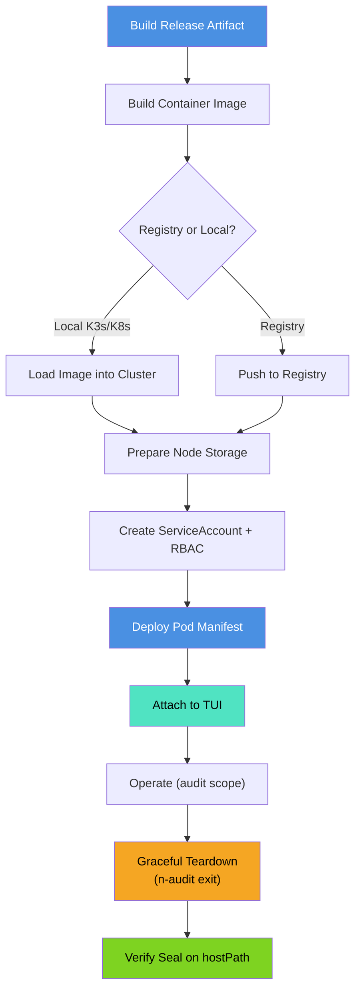

# Deployment Guide

Complete instructions for deploying N-Audit Sentinel on Kubernetes (K3s, K8s, or managed clusters with Cilium).

## Building & Testing Locally

Before deployment, build and test the project:

Use the Makefile for deterministic builds and tests or the Go helpers in `docs/DEPLOYMENT_HELPERS.md`.

Example (Makefile) — Go example:

```go
// Run Make targets from Go
package main

import (
  "log"
  "os"
  "os/exec"
)

func main() {
  if err := exec.Command("make", "build").Run(); err != nil {
    log.Fatal(err)
  }
  if err := exec.Command("make", "test").Run(); err != nil {
    log.Fatal(err)
  }
  _ = os.Stdout
}
```

Quick Go automation example (see full helpers in `docs/DEPLOYMENT_HELPERS.md`):

```go
// runmake.go (illustrative)
package main
import ("os/exec")
func main(){ exec.Command("make","build").Run(); exec.Command("make","test").Run() }
```

## Deployment Pipeline



## Prerequisites

**Kubernetes & Networking:**
- Kubernetes cluster (K3s, K8s, EKS, GKE, AKS, etc.) with **Cilium CNI** enabled
- Cilium must support `CiliumNetworkPolicy` CRD (v1.10+)
- `kubectl` CLI tool with cluster access

**Container Infrastructure:**
- Container build tool: `docker`, `podman`, or `nerdctl`
- Access to container registry (Docker Hub, local registry, etc.) OR local image loading for K3s/K8s

**Node Configuration:**
- Node with writable path for persistent logs: `/mnt/n-audit-data`
- Sufficient disk space for audit session logs (typically MB to GB per session)
- SSH key storage location: `/mnt/n-audit-data/signing/`

**Optional:**
- Terraform 1.0+ (for automated end-to-end deployment with `deploy/terraform/`)
- jq (for JSON parsing in automation)

## Step 1: Build or Import Container Image

### Option A: Local Build (K3s/K8s)

**Build and load image into local cluster:**

Use the Makefile release target or the image helpers in `docs/DEPLOYMENT_HELPERS.md`.

Quick steps:

```go
// Build release artifact and load image into K3s via shell pipeline
package main

import (
  "log"
  "os"
  "os/exec"
)

func main() {
  if err := exec.Command("make", "release", "VERSION=v1.0.0-Beta").Run(); err != nil {
    log.Fatal(err)
  }
  // Use a shell for the pipeline
  cmd := exec.Command("sh", "-c", "docker save n-audit-sentinel:v1.0.0-Beta | sudo k3s ctr images import -")
  cmd.Stdout = os.Stdout
  cmd.Stderr = os.Stderr
  if err := cmd.Run(); err != nil {
    log.Fatal(err)
  }
}
```

Example Go wrapper (illustrative):

```go
// loadimage.go
package main
import ("os/exec")
func main(){ exec.Command("sh","-c","docker save n-audit-sentinel:v1.0.0-Beta | sudo k3s ctr images import -").Run() }
```

### Option B: Registry-Based (Production)

**Push to Docker Hub or private registry:**

```go
// Build and push image using Docker from Go
package main

import (
  "log"
  "os"
  "os/exec"
)

func main() {
  if err := exec.Command("docker", "build", "-t", "your-registry/n-audit-sentinel:v1.0.0-Beta", ".").Run(); err != nil {
    log.Fatal(err)
  }
  if err := exec.Command("docker", "login").Run(); err != nil {
    log.Fatal(err)
  }
  if err := exec.Command("docker", "push", "your-registry/n-audit-sentinel:v1.0.0-Beta").Run(); err != nil {
    log.Fatal(err)
  }
  _ = os.Stdout
}
```

### Option C: Terraform-Driven (Recommended for Production)

**Automated end-to-end deployment:**

```go
// Run Terraform commands from Go (illustrative)
package main

import (
  "log"
  "os"
  "os/exec"
)

func main() {
  if err := os.Chdir("deploy/terraform"); err != nil {
    log.Fatal(err)
  }
  cmds := [][]string{
    {"terraform", "init"},
    {"terraform", "plan", "-var=namespace=default", "-var=image_name=n-audit-sentinel", "-var=image_tag=v1.0.0-Beta"},
    {"terraform", "apply", "-auto-approve"},
  }
  for _, a := range cmds {
    cmd := exec.Command(a[0], a[1:]...)
    cmd.Stdout = os.Stdout
    cmd.Stderr = os.Stderr
    if err := cmd.Run(); err != nil {
      log.Fatal(err)
    }
  }
}
```

Terraform handles:
- Pod creation with correct labels (`app: n-audit-sentinel`)
- ServiceAccount and RBAC bindings
- Volume mounts and hostPath configuration
- Environment variables

Customization via variables (see `deploy/terraform/variables.tf`):
- `namespace` — Kubernetes namespace
- `image_name` — Container image name
- `image_tag` — Image tag/version
- `storage_class` — Use PVC instead of hostPath (optional)

## Step 2: Prepare Node Storage and Signing Key

### Create hostPath directories

Refer to `docs/DEPLOYMENT_HELPERS.md` for a Go helper to prepare storage and keys.

Short Go usage:

```go
if err := PrepareStorageAndKeys("/mnt"); err != nil { panic(err) }
```

### Generate Ed25519 signing key

Key generation is handled by `PrepareStorageAndKeys` in `docs/DEPLOYMENT_HELPERS.md`.

It shells out to `ssh-keygen` and sets secure permissions. Example call (local operator):

```go
if err := PrepareStorageAndKeys("/mnt"); err != nil { log.Fatalf("setup failed: %v", err) }
```

**Important:** Keep the private key secure. Store backups in a secure location.

## Step 3: Create ServiceAccount and RBAC

N-Audit Sentinel requires a ServiceAccount with permissions to create, read, and delete `CiliumNetworkPolicy` resources.

### Apply RBAC manifests

**Option A: Use provided manifests (recommended)**


Use provided manifests or the programmatic `ApplyRBAC` helper in `docs/DEPLOYMENT_HELPERS.md`.

CLI example (apply manifest):

```go
// Apply ServiceAccount manifest via kubectl from Go
package main

import (
  "log"
  "os"
  "os/exec"
)

func main() {
  cmd := exec.Command("kubectl", "apply", "-f", "beta-test-deployment/serviceaccount.yaml")
  cmd.Stdout = os.Stdout
  cmd.Stderr = os.Stderr
  if err := cmd.Run(); err != nil {
    log.Fatal(err)
  }
  if err := exec.Command("kubectl", "get", "serviceaccount", "n-audit-sentinel").Run(); err != nil {
    log.Fatal(err)
  }
}
```

Go example (programmatic):

```go
// assume kubeClient is a configured client-go interface
if err := ApplyRBAC(kubeClient); err != nil { log.Fatalf("rbac apply failed: %v", err) }
```

**Option B: Apply inline YAML** (same manifest can be applied via `kubectl apply -f -` or programmatically via client-go; see `docs/DEPLOYMENT_HELPERS.md` for Go snippets).

### Verify permissions

```go
// Verify ServiceAccount and RBAC via kubectl from Go
package main

import (
  "log"
  "os"
  "os/exec"
)

func main() {
  if err := exec.Command("kubectl", "get", "sa", "n-audit-sentinel", "-o", "yaml").Run(); err != nil {
    log.Fatal(err)
  }
  if err := exec.Command("kubectl", "auth", "can-i", "create", "ciliumnetworkpolicies", "--as=system:serviceaccount:default:n-audit-sentinel").Run(); err != nil {
    log.Fatal(err)
  }
}
```

## Step 4: Deploy Pod Manifest

Apply the pod manifest with correct ServiceAccount, volume mounts, and environment variables.
```yaml
apiVersion: v1
kind: Pod
metadata:
  name: n-audit-sentinel
  labels:
    app: n-audit-sentinel
spec:
  serviceAccountName: n-audit-sentinel
  securityContext:
    runAsUser: 0
  containers:
  - name: sentinel
    image: n-audit-sentinel:v1.0.0-Beta
    stdin: true
    tty: true
    env:
    - name: SSH_SIGN_KEY_PATH
      value: "/var/lib/n-audit/signing/id_ed25519"
    volumeMounts:
    - name: data
      mountPath: /var/lib/n-audit
  volumes:
  - name: data
    hostPath:
      path: /mnt/n-audit-data
      type: DirectoryOrCreate
  restartPolicy: Always
```

**Apply the manifest:**

Use `kubectl apply` or the programmatic client in `docs/DEPLOYMENT_HELPERS.md`.

Go wrapper (apply manifest and verify):

```go
package main
import (
  "fmt"
  "os/exec"
)
func main(){
  // Apply manifest file
  exec.Command("kubectl","apply","-f","beta-test-deployment/pod-fixed.yaml").Run()
  // Verify pod state
  out,_ := exec.Command("kubectl","get","pods","n-audit-sentinel").CombinedOutput()
  fmt.Println(string(out))
}
```

## Step 5: Attach and Operate

### Start an Audit Session

Attach example (Go wrapper):

```go
cmd := exec.Command("kubectl","attach","-it","n-audit-sentinel","-c","sentinel")
cmd.Stdin = os.Stdin; cmd.Stdout = os.Stdout; cmd.Stderr = os.Stderr
cmd.Run()
```

**Follow TUI Prompts:**
1. Enter Pentester name
2. Enter Client name
3. Enter Layer 3 scope (IP/CIDR) — use double-Enter when done
4. Enter Layer 7 scope (Domains) — use double-Enter when done

**Inside the Shell:**
Execute your audit commands. All activity is logged with:
- ANSI codes stripped for clean logging
- Per-line timestamps in `YYYY-MM-DD HH:MM:SS` format
- Real-time writes to `/var/lib/n-audit/session.log`

### End the Session Gracefully

**From another terminal:**
Programmatic graceful shutdown (Go):

```go
exec.Command("kubectl","exec","n-audit-sentinel","-c","sentinel","--","/usr/local/bin/n-audit").Run()
```

This sends SIGUSR1 to PID 1, triggering:
1. Log closure
2. SHA256 computation
3. SSH cryptographic signature
4. FORENSIC SEAL appended to log
5. Cilium policy cleanup
6. Pod exit

## Step 6: Verify Logs and Seal

### Access Session Log

**From pod:**

Programmatic tail (Go):

```go
cmd := exec.Command("kubectl","exec","-it","n-audit-sentinel","--","tail","-f","/var/lib/n-audit/session.log")
cmd.Stdout = os.Stdout; cmd.Stderr = os.Stderr; cmd.Run()
```

**From host (via hostPath):**

On the node hosting the pod run (Go example):

```go
// Tail the session log on the node via Go (requires sudo)
package main

import (
  "log"
  "os/exec"
)

func main() {
  if err := exec.Command("sudo", "tail", "-f", "/mnt/n-audit-data/session.log").Run(); err != nil {
    log.Fatal(err)
  }
}
```

### Validate Log Integrity

**Check for FORENSIC SEAL block:**
Use the verification helper in `docs/DEPLOYMENT_HELPERS.md`. Example programmatic check (Go):

```go
// Read /mnt/n-audit-data/session.log until "=== FORENSIC SEAL ===" and compute sha256 on preceding bytes
package main
import (
  "bufio"
  "crypto/sha256"
  "fmt"
  "os"
)
func main(){
  f, _ := os.Open("/mnt/n-audit-data/session.log")
  defer f.Close()
  h := sha256.New()
  s := bufio.NewScanner(f)
  for s.Scan() {
    line := s.Text()
    if line == "=== FORENSIC SEAL ===" { break }
    h.Write([]byte(line+"\n"))
  }
  fmt.Printf("sha256: %x\n", h.Sum(nil))
}
```

**Verify SHA256:**
(See Go example above for programmatic extraction and hash computation.)

## Troubleshooting

| Issue | Root Cause | Solution |
|-------|-----------|----------|
| Pod fails to start | Missing ServiceAccount | Run `kubectl apply -f beta-test-deployment/serviceaccount.yaml` |
| Policy apply timeout | Cilium not healthy or RBAC missing | Verify `kubectl get ciliumnetworkpolicies` works; check Cilium pod logs |
| No TUI banner | Pod started before attach | Delete and restart: `kubectl delete pod n-audit-sentinel` |
| Missing seal block | SSH key not found or bad permissions | Verify: `ls -la /mnt/n-audit-data/signing/id_ed25519` (should be `600`) |
| Logs contain ANSI codes | Logger not initialized properly | Check pod logs: `kubectl logs n-audit-sentinel` |

### Debugging Commands


Programmatic debugging snippets (useful in automation; see `docs/DEPLOYMENT_HELPERS.md`):

```go
exec.Command("kubectl","describe","pod","n-audit-sentinel").Run()
exec.Command("kubectl","logs","n-audit-sentinel","-f").Run()
exec.Command("kubectl","get","ciliumnetworkpolicies").Run()
```

## Cross-References

- **[README.md](README.md)** — Architecture and feature overview
- **[VERIFICATION_GUIDE.md](VERIFICATION_GUIDE.md)** — Testing and validation procedures
- **[SECURITY.md](SECURITY.md)** — Security model and operational guidelines

---

## Advanced Deployment Architecture

### Container Image Build Strategy

The build process uses multi-stage compilation to minimize attack surface:

1. **Builder Stage (Compile):**
   - Base: `golang:1.25.3-alpine` (minimal attack surface)
   - Compile with flags: `CGO_ENABLED=0 GOOS=linux GOARCH=amd64`
   - Produces static binary (no libc dependencies)
   - ~71 MB uncompressed

2. **Runtime Stage (Kali Linux):**
   - Base: `kalilinux/kali:latest`
   - Copy compiled binary from builder
   - Includes penetration testing tools and utilities
   - Security focus: Immutable application binary, mutable audit logs

**Build command (deterministic):** (Go example)
```go
// Build docker image with deterministic build args via Go (uses sh -c for shell expansion)
package main

import (
  "log"
  "os/exec"
)

func main() {
  cmd := exec.Command("sh", "-c", "docker build --build-arg BUILD_DATE=$(date -u +'%Y-%m-%dT%H:%M:%SZ') --build-arg VCS_REF=$(git rev-parse --short HEAD) -t n-audit-sentinel:v1.0.0-Beta .")
  if err := cmd.Run(); err != nil {
    log.Fatal(err)
  }
}
```

### Cilium Policy Application Workflow

**Step-by-step policy enforcement:**

1. **Policy Generation** (`internal/policy`):
   ```go
   cnp := generateCiliumNetworkPolicy(scope)
   // Produces CiliumNetworkPolicy CRD YAML
   ```

2. **K8s API Submission**:
   - Marshals CRD to JSON
   - POSTs to Kubernetes API via bearer token
   - Endpoint: `/apis/cilium.io/v2/ciliumnetworkpolicies`
   - Namespace: `default` (configurable)

3. **eBPF Program Installation**:
   - Cilium agent receives CRD update
   - Compiles policy to eBPF bytecode
   - Loads into kernel via BPF system call
   - Installs on veth0 (container network interface)

4. **Packet Flow Interception**:
   - **Ingress**: Cilium XDP hook (pre-network-stack)
   - **Egress**: Cilium TC classifier (post-network-stack)
   - **L7 Inspection**: Cilium proxy intercepts DNS/HTTP traffic

5. **Policy Cleanup** (on SIGUSR1):
   - DELETEs CiliumNetworkPolicy resource
   - Cilium unloads eBPF programs
   - Kernel removes packet filtering hooks
   - Network returns to unrestricted state

### ServiceAccount & RBAC Integration

**Token-Based Authentication:**
- ServiceAccount token mounted at `/var/run/secrets/kubernetes.io/serviceaccount/token`
- Token includes: User identity (`system:serviceaccount:default:n-audit-sentinel`), signature, expiration
- Kubernetes validates token against service account's public key

**RBAC Policy Enforcement:**
```yaml
apiGroups: ["cilium.io"]
resources: ["ciliumnetworkpolicies"]
verbs: ["get", "list", "create", "delete", "update", "patch"]
```
Kubernetes API server checks:
1. Authenticated user identity
2. User's subject (ServiceAccount) bindings
3. ClusterRole rules matching requested resource/verb
4. Allows/denies API request

### Persistent Volume & hostPath Security

**hostPath Mount:**
- Pod volume references `/mnt/n-audit-data` on host node
- Container sees same path at `/var/lib/n-audit`
- Bidirectional: Container writes → Host file system

**File Permissions & Isolation:**
- Directory: `755` (`rwxr-xr-x`) — readable by audit review, writable by pod
- Log file: `644` (`rw-r--r--`) — readable for post-session analysis
- Signing directory: `700` (`rwx------`) — pod exclusive
- Private key: `600` (`rw-------`) — strong access control

**Persistence Guarantee:**
- Logs survive pod deletion (remain on host)
- Logs survive node restart (if hostPath on persistent storage)
- Consider using `PersistentVolume` + `StorageClass` for production

### Image Import/Load Strategies

**Local K3s (containerd backend):**
Use the Go helper in `docs/DEPLOYMENT_HELPERS.md` or run the Makefile target. Example wrapper:

```go
exec.Command("sh","-c","docker save image:tag | sudo k3s ctr images import -").Run()
```

**Standard K8s (Docker daemon):**
Use `make release` or the build helper; Go wrapper example:

```go
exec.Command("docker","build","-t","image:tag",".").Run()
```

**Remote Registry (Production):**
Use the registry push helper or `docker push` as required; for automation, call `exec.Command("docker","push",...)` from Go.
