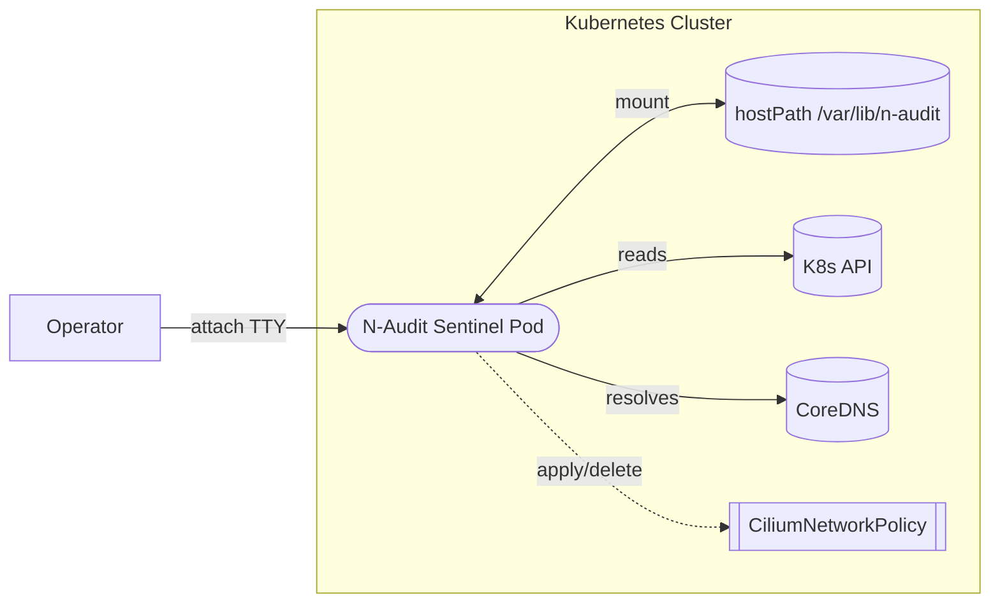
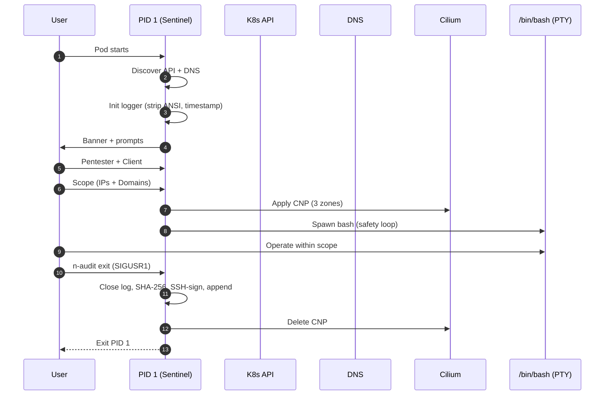

**Origin Note:** This project was architected and developed as a **proactive R&D initiative** ("going the extra mile") within the recruitment process.

# N-Audit Sentinel

```
███╗   ██╗       █████╗ ██╗   ██╗██████╗ ██╗████████╗    ███████╗███████╗███╗   ██╗████████╗██╗███╗   ██╗███████╗██╗     
████╗  ██║      ██╔══██╗██║   ██║██╔══██╗██║╚══██╔══╝    ██╔════╝██╔════╝████╗  ██║╚══██╔══╝██║████╗  ██║██╔════╝██║     
██╔██╗ ██║█████╗███████║██║   ██║██║  ██║██║   ██║       ███████╗█████╗  ██╔██╗ ██║   ██║   ██║██╔██╗ ██║█████╗  ██║     
██║╚██╗██║╚════╝██╔══██║██║   ██║██║  ██║██║   ██║       ╚════██║██╔══╝  ██║╚██╗██║   ██║   ██║██║╚██╗██║██╔══╝  ██║     
██║ ╚████║      ██║  ██║╚██████╔╝██████╔╝██║   ██║       ███████║███████╗██║ ╚████║   ██║   ██║██║ ╚████║███████╗███████╗
╚═╝  ╚═══╝      ╚═╝  ╚═╝ ╚═════╝ ╚═════╝ ╚═╝   ╚═╝       ╚══════╝╚══════╝╚═╝  ╚═══╝   ╚═╝   ╚═╝╚═╝  ╚═══╝╚══════╝╚══════╝
```

- Developer: Kristián Kašník
- Contact: itssafer@itssafer.org
- License: MIT License (Open Source)

N-Audit Sentinel is a Kubernetes‑native forensic wrapper that runs as PID 1 inside a Kali Linux pod. It hardens network access with Cilium, guarantees clean and human‑readable logs, and seals every session with a cryptographic signature.

## What, Why, How
- What: A safe, auditable, interactive shell for red team and forensics on Kubernetes.
- Why: Prevent mistakes (accidental exits), restrict traffic to explicit scope, and produce tamper‑evident logs.
- How: PID 1 safety loop, scope‑driven Cilium policy, ANSI‑free logs with timestamps, and SSH‑based sealing at teardown.

## Features at a Glance

| Capability | What it does | Why it matters |
|---|---|---|
| PID 1 Safety Loop | Respawns the shell on `exit`/Ctrl+D | Prevents accidental session loss |
| 3‑Zone Cilium Policy | Infra (API+DNS), Maintenance (HTTP/S to repos), Target (your scope) | Blocks out‑of‑scope traffic by default |
| Scope‑Driven Enforcement | IP/CIDR + Domains via TUI (double‑enter) | Clear, explicit authorization surface |
| Clean Logging | Strips ANSI; timestamps each line as `YYYY‑MM‑DD HH:MM:SS` | Human‑readable, diff‑friendly logs |
| Real‑time Flush | `O_SYNC` file writes | Live tailing via SSHFS without delays |
| Cryptographic Seal | Appends SHA‑256 and SSH signature at teardown | Tamper‑evident audit trail |
| Kubernetes‑Aware | Auto‑discovers API and DNS | No manual wiring for cluster basics |
| Open Source | MIT licensed | Transparent and extensible |

## Architecture



Key modules
- `cmd/n-audit-sentinel`: PID 1 runtime and session lifecycle
- `cmd/n-audit`: helper to trigger graceful exit (sends SIGUSR1)
- `internal/logger`: PTY sanitization + per‑line timestamps (`YYYY‑MM‑DD HH:MM:SS`)
- `internal/policy`: Cilium policy generation/apply/delete
- `internal/recorder`: PTY and safety loop
- `internal/tui`: banner + prompts (double‑enter)
- `internal/validation`: normalization and guardrails for IPs/CIDRs/domains

## Sequence (Happy Path)



## Quick Start

For a full deployment guide (K3s/K8s), see `DEPLOYMENT.md`. For verification steps, see `VERIFICATION_GUIDE.md`.

Minimal workflow
1) Build release: `make release VERSION=v1.0.0-final`
2) Prepare hostPath on the node: `/mnt/n-audit-data` with subdir `signing/` and an Ed25519 key `id_ed25519`
3) Create ServiceAccount + RBAC for Cilium CRDs
4) Run the pod with `serviceAccountName` and mount `/var/lib/n-audit` to the hostPath
5) `kubectl attach -it n-audit-sentinel -c sentinel` and follow the TUI

Cross‑links
- Deployment: `DEPLOYMENT.md`
- Post‑deployment checks: `VERIFICATION_GUIDE.md`

## Runtime Behavior
- TUI captures Pentester and Client and your explicit scope.
- Logs are written to `/var/lib/n-audit/session.log` inside the pod (typically host‑mounted at `/mnt/n-audit-data/session.log`).
- Safety loop: typing `exit` or Ctrl+D respawns the shell. To end, run `n-audit exit` (sends SIGUSR1).
- Teardown appends a “FORENSIC SEAL” block with SHA‑256 and an SSH signature.

## Security Considerations

Why these choices
- Why PID 1: To control lifecycle and signals reliably; avoid accidental termination; guarantee teardown sealing.
- Why root by default (configurable): Many forensic tasks require elevated capabilities. If not needed, run as a non‑root user and review resulting limitations.
- Why Cilium: Granular, identity‑aware network policies and high‑quality L3/L7 enforcement for scope‑driven lockdown.

Forensic guarantees
- Human‑readable timestamps: each line prefixed with `YYYY‑MM‑DD HH:MM:SS` (UTC).
- ANSI‑free logs: all terminal escape sequences are removed before persistence.
- Real‑time writes: `O_SYNC` flush enables live tailing from mounted storage.
- Cryptographic sealing: SHA‑256 of the session content + OpenSSH signature appended at teardown.

Operational notes
- Private key path: set `SSH_SIGN_KEY_PATH` (e.g., `/var/lib/n-audit/signing/id_ed25519`), permissions `700` dir and `600` key.
- ServiceAccount + RBAC: required to create/delete `ciliumnetworkpolicies.cilium.io`.
- Label selectors: the pod must be labeled `app: n-audit-sentinel` to match the policy.

## Build & Release

Local builds
```bash
go build -o bin/n-audit-sentinel ./cmd/n-audit-sentinel
go build -o bin/n-audit ./cmd/n-audit
```

Create a release artifact
```bash
make release VERSION=v1.0.0-final
```
Artifacts
- `n-audit-sentinel-<version>-linux-amd64.tar.gz`
- `n-audit-sentinel-<version>-linux-amd64.tar.gz.sha256`

## Deployment Options

- Quick start (manifests): See `DEPLOYMENT.md` for hostPath + RBAC pod YAMLs.
- Terraform (full workflow): Use `deploy/terraform` to provision storage, labels, and the pod end-to-end. The variables allow overriding image name/tag and storage class. After `terraform apply`, attach with:
```bash
kubectl attach -it n-audit-sentinel -c sentinel
```
Post-deployment checks are in `VERIFICATION_GUIDE.md`.

## License
MIT License © Kristián Kašník - ITSsafer-DevOps and contributors. See `LICENSE` for details.

## Links
- Deployment: `DEPLOYMENT.md`
- Verification: `VERIFICATION_GUIDE.md`

## Runtime Parameters & systemd service example

Recommended runtime parameters (examples):

- `--system-audit` : run a basic OS audit scan (default quick checks)
- `--verbose` : enable verbose logging for troubleshooting
- `--log-file /var/lib/n-audit/session.log` : explicit log file location
- `--sign-key /var/lib/n-audit/signing/id_ed25519` : path to SSH signing key

Example `systemd` unit (create `/etc/systemd/system/n-audit-sentinel.service`):

```ini
[Unit]
Description=N-Audit Sentinel (local system audit)
After=network.target

[Service]
Type=simple
User=root
WorkingDirectory=/var/lib/n-audit
ExecStart=/usr/local/bin/n-audit-sentinel --system-audit --log-file /var/lib/n-audit/session.log --sign-key /var/lib/n-audit/signing/id_ed25519
Restart=on-failure
RestartSec=5

[Install]
WantedBy=multi-user.target
```

Notes:

- Ensure the `sign-key` exists and is protected (`chmod 600`) and the directory is `700`.
- Adjust `User=` to a non-root account if you prefer reduced privileges (verify required capabilities).
- Use `journalctl -u n-audit-sentinel -f` to follow logs when running under `systemd`.
