# N-Audit Sentinel

```
███╗   ██╗       █████╗ ██╗   ██╗██████╗ ██╗████████╗    ███████╗███████╗███╗   ██╗████████╗██╗███╗   ██╗███████╗██╗     
████╗  ██║      ██╔══██╗██║   ██║██╔══██╗██║╚══██╔══╝    ██╔════╝██╔════╝████╗  ██║╚══██╔══╝██║████╗  ██║██╔════╝██║     
██╔██╗ ██║█████╗███████║██║   ██║██║  ██║██║   ██║       ███████╗█████╗  ██╔██╗ ██║   ██║   ██║██╔██╗ ██║█████╗  ██║     
██║╚██╗██║╚════╝██╔══██║██║   ██║██║  ██║██║   ██║       ╚════██║██╔══╝  ██║╚██╗██║   ██║   ██║██║╚██╗██║██╔══╝  ██║     
██║ ╚████║      ██║  ██║╚██████╔╝██████╔╝██║   ██║       ███████║███████╗██║ ╚████║   ██║   ██║██║ ╚████║███████╗███████╗
╚═╝  ╚═══╝      ╚═╝  ╚═╝ ╚═════╝ ╚═════╝ ╚═╝   ╚═╝       ╚══════╝╚══════╝╚═╝  ╚═══╝   ╚═╝   ╚═╝╚═╝  ╚═══╝╚══════╝╚══════╝
```

**Developer:** Kristián Kašník  
**Contact:** itssafer@itssafer.org  
**LinkedIn:** linkedin.com/in/kristián-kašník-03056a377  
**License:** MIT License (Open Source)

### Repository Contents
This repository contains:
- Complete Go source code for the N-Audit Sentinel application
- Internal packages with comprehensive test coverage (49% overall, 91%+ signature/policy/tui)
- Go-based utilities for deterministic builds and packaging (`release-manager`, `backup-manager`)
- Deployment manifests and Terraform configurations
- Comprehensive documentation and verification guides

**Note:** Binary release artifacts (`.tar.gz`) are produced by the release pipeline and stored as GitHub Releases, not in Git history. Legacy shell scripts have been removed; use the Go utilities under `cmd/` for all build, packaging, and archival operations.

N-Audit Sentinel is a Kubernetes‑native forensic wrapper that runs as PID 1 inside a Kali Linux pod. It hardens network access with Cilium, guarantees clean and human‑readable logs, and seals every session with a cryptographic signature.

## Core Principles

**What:** N-Audit Sentinel is a Kubernetes-native forensic wrapper that provides controlled network access, cryptographic audit trails, and tamper-evident session recording.

**Why:** Penetration testers need strong guarantees that their session scope is enforced, all commands are logged cleanly, and logs cannot be modified undetected. Cilium policies provide granular network enforcement; cryptographic seals provide integrity verification.

**How:** The application runs as PID 1 in a Kali Linux pod, discovers the Kubernetes API and DNS at startup, accepts scope from a TUI, applies Cilium network policies, and records all PTY activity with timestamps and a final cryptographic seal.

## Go-Based Release & Backup Utilities

The project includes two production-grade Go utilities that replace legacy shell scripts:

### release-manager
**Location:** `cmd/release-manager`  
**Purpose:** Builds binaries with deterministic flags, packages them into `.tar.gz` archives, and generates SHA256 checksums.

**Example:**
```bash
go run ./cmd/release-manager --version v1.0.0-Beta --out out
# Creates: n-audit-sentinel-v1.0.0-Beta-linux-amd64.tar.gz
#          n-audit-sentinel-v1.0.0-Beta-linux-amd64.tar.gz.sha256
```

### backup-manager
**Location:** `cmd/backup-manager`  
**Purpose:** Creates a Gold Master source archive using `git archive` and generates SHA256 checksums for reproducibility.

**Example:**
```bash
go run ./cmd/backup-manager --out gold-master-20251210T235959Z.tar.gz --ref HEAD
```

Both utilities are tested, minimal, and designed for local development and CI pipelines. See `cmd/*/README.md` for complete usage documentation.
## Features at a Glance

| Capability | What it does | Why it matters |
|---|---|---|
| PID 1 Safety Loop | Respawns the shell on `exit`/Ctrl+D | Prevents accidental session loss |
| 3‑Zone Cilium Policy | Infra (API+DNS), Maintenance (HTTP/S to repos), Target (your scope) | Blocks out‑of‑scope traffic by default |
| Scope‑Driven Enforcement | IP/CIDR + Domains via TUI (double‑enter) | Clear, explicit authorization surface |
| Clean Logging | Strips ANSI; timestamps each line as `YYYY‑MM‑DD HH:MM:SS` | Human‑readable, diff‑friendly logs |
| Real‑time Flush | `O_SYNC` file writes | Live tailing via SSHFS without delays |
| Cryptographic Seal | Appends SHA‑256 and SSH signature at teardown | Tamper‑evident audit trail |
| Kubernetes‑Aware | Auto‑discovers API and DNS | No manual wiring for cluster basics |
| Open Source | MIT licensed | Transparent and extensible |

## Architecture

### Kubernetes Integration

```mermaid
graph LR
    subgraph cluster["Kubernetes Cluster"]
        direction TB
        Pod["🔷 N-Audit Sentinel<br/>PID 1 Runtime<br/>Kali Linux"]
        Vol[("hostPath Volume<br/>/var/lib/n-audit")]
        API["Kubernetes API<br/>Service Discovery<br/>10.43.0.1:443"]
        DNS["CoreDNS<br/>Domain Resolution<br/>10.43.0.10"]
        CNP["Cilium Network Policy<br/>Scope Enforcement<br/>L3/L7 Rules"]
        
        Pod -->|auto-discover| API
        Pod -->|auto-discover| DNS
        Pod -->|create/delete| CNP
        Pod <-->|mount| Vol
    end
    
    User["🎯 Pentester/Auditor<br/>Security Researcher"] -->|kubectl attach -it<br/>TTY| Pod
    
    style Pod fill:#4A90E2,stroke:#2E5C8A,stroke-width:2px,color:#fff
    style Vol fill:#50E3C2,stroke:#2E8B74,stroke-width:2px,color:#000
    style API fill:#E8F4F8,stroke:#4A90E2,stroke-width:2px,color:#000
    style DNS fill:#E8F4F8,stroke:#4A90E2,stroke-width:2px,color:#000
    style CNP fill:#F5A623,stroke:#B8770B,stroke-width:2px,color:#000
    style User fill:#7ED321,stroke:#5FA818,stroke-width:2px,color:#000
```



### Core Modules

| Module | Location | Purpose | Implementation Details |
|--------|----------|---------|--------------------------|
| **PID 1 Runtime** | `cmd/n-audit-sentinel` | Process lifecycle, signal handling (SIGUSR1), session teardown with graceful shutdown guarantees | Handles init process responsibilities, reaps zombies, manages bash respawning via safety loop, coordinates teardown with logger and policy cleanup |
| **Exit Helper** | `cmd/n-audit` | Graceful SIGUSR1 sender for triggering controlled session termination | Lightweight utility that signals PID 1 to initiate forensic seal and policy cleanup |
| **Logger** | `internal/logger` | ANSI stripping via regex, per-line timestamp injection (`YYYY-MM-DD HH:MM:SS UTC`), O_SYNC writes for real-time persistence | PTY data sanitization with `regexp.Compile()`, per-line timestamp prefixing, file operations with `os.O_SYNC` flag for immediate disk flush |
| **Policy Engine** | `internal/policy` | Cilium policy generation (3-zone model: Infra/Maintenance/Target), validation, apply/delete orchestration with K8s API | Generates CiliumNetworkPolicy CRD YAML, applies via kubectl exec/API, validates CIDR/domain format, manages policy lifecycle |
| **PTY Recorder** | `internal/recorder` | Terminal session capture, ANSI stripping, safety loop respawning on bash exit, session lifecycle coordination | Captures PTY master/slave, coordinates with logger and signature modules, implements safety loop preventing accidental session termination |
| **TUI** | `internal/tui` | Interactive banner display, scope prompts (double-Enter for finalization), Pentester/Client metadata capture | Formatted banner, prompts with input validation, double-Enter state machine for list finalization |
| **Validation** | `internal/validation` | IP/CIDR/domain normalization, guardrails for policy scope definition, format validation | CIDR parsing with `net.ParseCIDR()`, domain validation, prevents invalid scope definitions |
| **Signature** | `internal/signature` | SHA256 hashing of session content, SSH Ed25519 signing (OpenSSH format), FORENSIC SEAL appending | Computes SHA256 of log content, signs with SSH private key, appends structured seal block to log |
| **Discovery** | `internal/discovery` | Kubernetes API auto-discovery via `$KUBERNETES_SERVICE_HOST:$KUBERNETES_SERVICE_PORT`, DNS server detection from `resolv.conf` | Reads K8s in-pod environment variables, parses `/etc/resolv.conf` for DNS servers |
| **Backup Manager** | `cmd/backup-manager` | Gold Master source archival using `git archive`, reproducible checksums, audit trail of releases | Uses `git archive` for deterministic source snapshots, generates SHA256 for verification |
| **Release Manager** | `cmd/release-manager` | Deterministic binary packaging, `GOOS=linux GOARCH=amd64` flags, reproducible artifact generation | Builds with fixed flags, tars binaries, generates SHA256 for release artifacts |

### Session Lifecycle (Happy Path)


## Quick Start

For complete deployment instructions, see [DEPLOYMENT.md](DEPLOYMENT.md). For verification and testing, see [VERIFICATION_GUIDE.md](VERIFICATION_GUIDE.md).

### Minimal 5-Step Workflow

1. **Build Release**
   ```bash
   make release VERSION=v1.0.0-Beta
   ```

2. **Prepare Node Storage**
   ```bash
   sudo mkdir -p /mnt/n-audit-data/signing
   sudo ssh-keygen -t ed25519 -N "" -f /mnt/n-audit-data/signing/id_ed25519 -C "n-audit"
   sudo chmod 600 /mnt/n-audit-data/signing/id_ed25519
   ```

3. **Create ServiceAccount + RBAC**
   ```bash
   kubectl apply -f beta-test-deployment/serviceaccount.yaml
   ```

4. **Deploy Pod**
   ```bash
   kubectl apply -f beta-test-deployment/pod-fixed.yaml
   ```

5. **Attach and Operate**
   ```bash
   kubectl attach -it n-audit-sentinel -c sentinel
   # Follow TUI prompts: Pentester, Client, Scope (IPs/Domains)
   # Exit: n-audit exit (graceful teardown with seal)
   ```

## Runtime Behavior
- TUI captures Pentester and Client and your explicit scope.
- Logs are written to `/var/lib/n-audit/session.log` inside the pod (typically host‑mounted at `/mnt/n-audit-data/session.log`).
- Safety loop: typing `exit` or Ctrl+D respawns the shell. To end, run `n-audit exit` (sends SIGUSR1).
- Teardown appends a “FORENSIC SEAL” block with SHA‑256 and an SSH signature.

## Security Considerations

Why these choices
- Why PID 1: To control lifecycle and signals reliably; avoid accidental termination; guarantee teardown sealing.
- Why root by default (configurable): Many forensic tasks require elevated capabilities. If not needed, run as a non‑root user and review resulting limitations.
- Why Cilium: Granular, identity‑aware network policies and high‑quality L3/L7 enforcement for scope‑driven lockdown.

Forensic guarantees
- Human‑readable timestamps: each line prefixed with `YYYY‑MM‑DD HH:MM:SS` (UTC).
- ANSI‑free logs: all terminal escape sequences are removed before persistence.
- Real‑time writes: `O_SYNC` flush enables live tailing from mounted storage.
- Cryptographic sealing: SHA‑256 of the session content + OpenSSH signature appended at teardown.

Operational notes
- Private key path: set `SSH_SIGN_KEY_PATH` (e.g., `/var/lib/n-audit/signing/id_ed25519`), permissions `700` dir and `600` key.
- ServiceAccount + RBAC: required to create/delete `ciliumnetworkpolicies.cilium.io`.
- Label selectors: the pod must be labeled `app: n-audit-sentinel` to match the policy.

## Build & Release

### Local Development Build
```bash
# Build individual binaries
go build -o bin/n-audit-sentinel ./cmd/n-audit-sentinel
go build -o bin/n-audit ./cmd/n-audit

# Run tests
go test ./...
```

### Release Build (Production)
```bash
# Create release artifacts with Makefile
make release VERSION=v1.0.0-Beta
```

**Output Artifacts:**
- `n-audit-sentinel-v1.0.0-Beta-linux-amd64.tar.gz` — Binary archive
- `n-audit-sentinel-v1.0.0-Beta-linux-amd64.tar.gz.sha256` — SHA256 checksum
- `gold-master-<timestamp>.tar.gz` — Source code archive (optional)

### Verification
```bash
# Verify SHA256
sha256sum -c n-audit-sentinel-v1.0.0-Beta-linux-amd64.tar.gz.sha256

# Extract and test
tar -xzf n-audit-sentinel-v1.0.0-Beta-linux-amd64.tar.gz
./n-audit-sentinel --version
```

## Deployment Methods

### Method 1: Manifest-Based (kubectl)
Manifest files are provided in `beta-test-deployment/`:
- `serviceaccount.yaml` — ServiceAccount and RBAC bindings for Cilium
- `pod-fixed.yaml` — Complete pod definition with mounts and env vars

```bash
kubectl apply -f beta-test-deployment/serviceaccount.yaml
kubectl apply -f beta-test-deployment/pod-fixed.yaml
```

### Method 2: Terraform (Reproducible)
For automated, version-controlled deployments, use `deploy/terraform/`:

```bash
cd deploy/terraform
terraform init
terraform apply -auto-approve \
  -var="namespace=default" \
  -var="image_name=n-audit-sentinel" \
  -var="image_tag=v1.0.0-Beta"
```

Variables support customization of image, storage class, and namespace. See `deploy/terraform/variables.tf` for details.

## License

MIT License © Kristián Kašník - ITSsafer-DevOps and contributors.  
See [LICENSE](LICENSE) for full text.

---

## Additional Resources

- **[DEPLOYMENT.md](DEPLOYMENT.md)** — Full deployment and configuration guide
- **[VERIFICATION_GUIDE.md](VERIFICATION_GUIDE.md)** — Testing and validation procedures
- **[SECURITY.md](SECURITY.md)** — Security model and operational guidelines
- **[docs/TOOLS.md](docs/TOOLS.md)** — Go utility reference (release-manager, backup-manager)

## Local systemd Deployment (Optional)

For running N-Audit Sentinel as a local systemd service (without Kubernetes), install the provided unit file:

```bash
sudo cp deploy/n-audit-sentinel.service /etc/systemd/system/
sudo systemctl daemon-reload
sudo systemctl enable --now n-audit-sentinel.service

# Monitor logs
sudo journalctl -u n-audit-sentinel -f
```

### Configuration

**Runtime Parameters:**
- `--system-audit` — Perform basic OS audit scan
- `--verbose` — Enable verbose logging for troubleshooting
- `--log-file /var/lib/n-audit/session.log` — Explicit log file location
- `--sign-key /var/lib/n-audit/signing/id_ed25519` — Path to SSH signing key

**Key Requirements:**
- Signing key must exist and be protected: `chmod 600`
- Signing directory must be restricted: `chmod 700`
- Run as `root` for full capabilities (or review required capabilities for non-root)
- See [deploy/n-audit-sentinel.service](deploy/n-audit-sentinel.service) for complete unit configuration

---

## Advanced Technical Architecture

### Go Concurrency & Goroutine Model

N-Audit Sentinel employs a hierarchical goroutine architecture for coordinating simultaneous operations:

- **Main Goroutine (PID 1):** Orchestrates signal handlers (SIGTERM, SIGUSR1, SIGCHLD), manages bash respawn loop, coordinates teardown sequence
- **Logger Goroutine:** Asynchronous PTY data processing with per-line ANSI stripping and timestamp injection
- **Policy Goroutine:** Cilium API interaction for policy apply/delete with exponential backoff on failures
- **Recorder Goroutine:** Continuous PTY master read with non-blocking I/O, buffering, and coordination with logger

**Synchronization:** Uses channels for signaling across goroutines, ensuring graceful shutdown coordination.

### Kubernetes Network Layer Integration

**In-Pod Environment Detection:**
- Reads `$KUBERNETES_SERVICE_HOST` and `$KUBERNETES_SERVICE_PORT` environment variables injected by Kubelet
- Default values: `10.43.0.1:443` (K3s) or `10.96.0.1:443` (standard K8s)
- Validates API server connectivity before proceeding

**DNS Resolution:**
- Parses `/etc/resolv.conf` for nameserver entries
- Reads search domain from pod's DNS config
- Cilium L7 DNS policies inspect and enforce domain-level access

**Service Account Authentication:**
- Mounts ServiceAccount token at `/var/run/secrets/kubernetes.io/serviceaccount/token`
- Used for CiliumNetworkPolicy CRUD operations
- Bearer token included in API requests to Kubernetes

### Cilium 3-Zone Network Policy Model

The policy engine implements a sophisticated 3-zone segmentation:

**Zone 1 (Infrastructure):**
- Kubernetes API Server (`10.43.0.1:443`)
- CoreDNS resolvers (typically `10.43.0.10`)
- Essential cluster services for operation
- Allowed: Always (required for pod functionality)

**Zone 2 (Maintenance):**
- Package repositories (HTTP/HTTPS)
- Update sources
- Tool installation endpoints
- Allowed: Only for utility setup phase

**Zone 3 (Target/Scope):**
- User-defined audit scope (IPs, CIDRs, domains)
- Dynamically populated from TUI input
- Enforced at L3 (IP-level) and L7 (DNS/HTTP domain-level)
- Allowed: Only if explicitly in scope

**Policy Enforcement Mechanism:**
- Cilium converts policies to eBPF programs
- eBPF hooks at kernel network stack (XDP, TC)
- Stateless L3 packet filtering + stateful L7 proxy inspection
- Real-time counters and visibility

### Cryptographic Sealing & Attestation

**SHA256 Content Hashing:**
- Computed over entire session log (excluding seal block)
- Uses Go's `crypto/sha256` package
- Hex-encoded (64-character string)
- Prevents undetected modifications to audit trail

**SSH Ed25519 Signing:**
- Private key: 32-byte Ed25519 private key from OpenSSH format
- Public key: 32-byte compressed point
- Signature: 64-byte signature over SHA256 hash
- OpenSSH format for compatibility with standard tooling

**FORENSIC SEAL Block Structure:**
```
=== FORENSIC SEAL ===
SHA256 Hash: <64-char hex>
SSH Signature (Base64): <base64-encoded 64-byte signature>
=====================
```

**Verification Chain:**
1. Extract content (lines before FORENSIC SEAL)
2. Compute SHA256 of extracted content
3. Compare with SHA256 Hash line
4. Validate SSH signature using public key

### PTY Handling & Terminal Emulation

**PTY Master/Slave Architecture:**
- N-Audit opens `/dev/ptmx` for master side
- Spawns `/bin/bash` with slave side attached
- Raw mode: Disables canonical input processing
- Direct pass-through of data between user terminal and bash

**Safety Loop Implementation:**
```go
for {
    select {
    case sig := <-sigChan:
        if sig == SIGUSR1 { 
            // Graceful exit
            return
        }
    case <-cmdChan:
        // Process user command
    }
    bash.Wait()  // Respawn if exited unexpectedly
}
```
Ensures `exit` or Ctrl+D doesn't terminate the pod.

### Testing & Coverage Metrics

- **Overall Coverage:** 49%
- **High-Coverage Modules:**
  - `internal/signature` — 91.3% (cryptographic operations)
  - `internal/tui` — 88.7% (user interaction flows)
  - `internal/discovery` — 95.5% (environment detection)
- **Test Count:** 49 unit tests across 9 packages
- **Benchmarks:** Signature performance (hash/sign ops), policy generation time

**Critical Paths Covered:**
- Policy generation for various scope combinations
- ANSI stripping across diverse terminal output
- Graceful shutdown coordination
- SHA256/SSH signature verification
