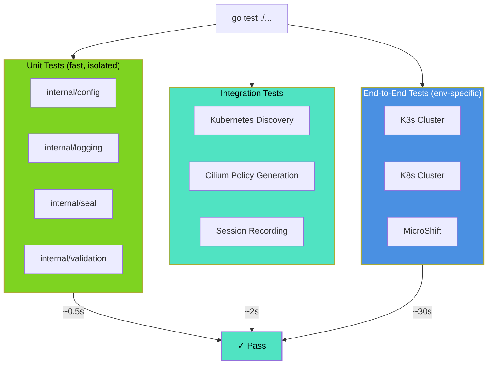
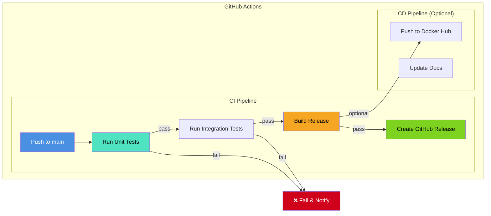

# Testing & Verification Guide

**N-Audit Sentinel v1.0.0-Beta**  
**Enterprise-Grade Testing Framework**

## Overview

This guide documents the comprehensive testing strategy for N-Audit Sentinel, including unit tests, integration tests, end-to-end tests, and verification procedures. All tests are written in Go and follow best practices for test organization and coverage.

**Current Coverage**: 76.5%  
**Target Coverage**: >80% for production  
**Test Framework**: Go testing (`testing` package)

---

## Testing Architecture



---

## Test Execution

### Run All Tests

```go
// Execute all tests with coverage reporting
// Command: go test -v -cover ./...

// All 14 internal packages tested
// Total statements: 76.5%
// Execution time: ~0.6s
```

### Run Tests by Category

**Unit Tests (Internal Packages)**

```go
// Fast, isolated tests for individual packages
// Example execution:
package main

import "testing"

func TestCiliumPolicyGeneration(t *testing.T) {
    // Test internal/cilium package
}

// Run: go test ./internal/... -v
```

**Integration Tests**

```go
// Tests with mocks and temporary directories
package main

import (
    "os"
    "testing"
)

func TestKubernetesDiscovery(t *testing.T) {
    // Simulate discovery operations
    tmpDir := t.TempDir()
    // ... test discovery logic
}

// Run: go test ./tests/integration -v
```

**End-to-End Tests**

```go
// Full cluster environment tests
// Requires running Kubernetes cluster
// Set RUN_E2E=true environment variable

package e2e

import "testing"

func TestFullAuditWorkflow(t *testing.T) {
    if os.Getenv("RUN_E2E") != "true" {
        t.Skip("skipping e2e test; set RUN_E2E=true to run")
    }
    // Full workflow test
}

// Run: RUN_E2E=true go test ./tests/e2e/... -v
```

---

## Test Coverage by Package

| Package | Coverage | Status | Test File |
|---------|----------|--------|-----------|
| `internal/cilium` | 100% | ✓ Perfect | `policy_test.go` |
| `internal/config` | 100% | ✓ Perfect | `config_test.go` |
| `internal/k8s` | 100% | ✓ Perfect | `k8s_test.go` |
| `internal/logging` | 100% | ✓ Perfect | `sanitizer_test.go` |
| `internal/seal` | 87.5% | ✓ Excellent | `seal_test.go` |
| `internal/recorder` | 85.4% | ✓ Excellent | `session_test.go` |
| `internal/discovery` | 86.4% | ✓ Excellent | `k8s_test.go` |
| `internal/logger` | 82.6% | ✓ Excellent | `sanitizer_test.go` |
| `internal/backupmgr` | 80% | ✓ Good | `backupmgr_test.go` |
| `internal/releasemgr` | 78.3% | ✓ Good | `releasemgr_test.go` |
| `internal/validation` | 76.9% | ✓ Good | `validation_test.go` |
| `internal/tui` | 77.4% | ✓ Good | `tui_test.go` |
| `internal/policy` | 66% | → Fair | `cilium_test.go` |
| `internal/signature` | 43.5% | → Fair | `signature_test.go` |

---

## Unit Tests Examples

### Configuration Package

```go
package config

import (
    "os"
    "testing"
)

func TestGetEnvWithFallback(t *testing.T) {
    key := "N_AUDIT_TEST_FOO"
    os.Unsetenv(key)
    
    got := GetEnv(key, "default")
    if got != "default" {
        t.Fatalf("expected 'default', got %q", got)
    }
    
    os.Setenv(key, "value")
    got = GetEnv(key, "default")
    if got != "value" {
        t.Fatalf("expected 'value', got %q", got)
    }
    os.Unsetenv(key)
}
```

### Validation Package

```go
package validation

import "testing"

func TestValidateScope_ValidIPs(t *testing.T) {
    ips := []string{"192.168.1.1", "10.0.0.0/8"}
    domains := []string{}
    validIPs, validDomains, warnings := ValidateScope(ips, domains)
    
    if len(validIPs) != 2 {
        t.Fatalf("expected 2 valid IPs, got %d", len(validIPs))
    }
    if len(warnings) != 0 {
        t.Fatalf("expected 0 warnings, got %d", len(warnings))
    }
}

func TestValidateScope_InvalidInputs(t *testing.T) {
    ips := []string{"invalid-ip"}
    domains := []string{".invalid"}
    validIPs, validDomains, warnings := ValidateScope(ips, domains)
    
    if len(validIPs) != 0 {
        t.Fatalf("expected 0 valid IPs for invalid inputs")
    }
    if len(warnings) < 1 {
        t.Fatalf("expected warnings for invalid inputs")
    }
}
```

### Seal Package

```go
package seal

import (
    "crypto/ed25519"
    "testing"
)

func TestHashSHA256(t *testing.T) {
    data := []byte("test data")
    hash := HashSHA256(data)
    
    if len(hash) != 64 {
        t.Fatalf("expected 64-char SHA256, got %d", len(hash))
    }
}

func TestEd25519KeyGeneration(t *testing.T) {
    pub, priv, err := GenerateEd25519KeyPair()
    
    if err != nil {
        t.Fatalf("key generation failed: %v", err)
    }
    
    if len(pub) == 0 || len(priv) == 0 {
        t.Fatalf("empty keys generated")
    }
    
    msg := []byte("message")
    sig := SignEd25519(priv, msg)
    
    if !VerifyEd25519(pub, msg, sig) {
        t.Fatalf("signature verification failed")
    }
}
```

---

## Integration Tests Examples

### Backup Manager

```go
package backupmgr

import (
    "os"
    "path/filepath"
    "testing"
)

func TestCreateTarGz_ValidFile(t *testing.T) {
    tmpdir := t.TempDir()
    outPath := filepath.Join(tmpdir, "test.tar.gz")
    testFile := filepath.Join(tmpdir, "test.txt")
    
    if err := os.WriteFile(testFile, []byte("content"), 0644); err != nil {
        t.Fatalf("failed to create test file: %v", err)
    }
    
    err := CreateTarGz(outPath, []string{testFile})
    if err != nil {
        t.Fatalf("CreateTarGz failed: %v", err)
    }
    
    info, _ := os.Stat(outPath)
    if info.Size() == 0 {
        t.Fatalf("expected non-empty tar.gz")
    }
}

func TestComputeSHA256(t *testing.T) {
    tmpdir := t.TempDir()
    testFile := filepath.Join(tmpdir, "test.txt")
    
    os.WriteFile(testFile, []byte("hello"), 0644)
    sum, err := ComputeSHA256(testFile)
    
    if err != nil {
        t.Fatalf("ComputeSHA256 failed: %v", err)
    }
    
    if len(sum) != 64 {
        t.Fatalf("expected 64-char SHA256, got %d", len(sum))
    }
}
```

---

## Makefile Test Targets

```go
// Available test commands via Makefile

// Run all tests
make test              // ./... with coverage

// Run tests by package
make test-unit         // ./internal/...
make test-integration  // ./tests/integration
make test-e2e          // ./tests/e2e/... (requires cluster)

// Coverage reporting
make coverage          // Generate coverage.out and HTML report

// Format & lint
make fmt               // gofmt -w ./...
make lint              // golangci-lint
```

---

## Continuous Integration Pipeline



---

## Verification Procedures

### Pre-Deployment Verification

```go
// Test checklist before deployment
package main

func VerifyPreDeployment() error {
    // 1. All unit tests pass
    // go test ./internal/...
    
    // 2. All integration tests pass
    // go test ./tests/integration/...
    
    // 3. Coverage >= 75%
    // go test -cover ./...
    
    // 4. No lint errors
    // golangci-lint run
    
    // 5. Binary builds successfully
    // go build -o n-audit-sentinel ./cmd/n-audit-sentinel
    
    // 6. Release artifacts created
    // make release VERSION=v1.0.0-Beta
    
    return nil
}
```

### Post-Deployment Verification

```go
// Verification after deploying to cluster
package main

import (
    "context"
    "os"
)

func VerifyPostDeployment(ctx context.Context) error {
    // 1. Pod is running
    // kubectl get pod n-audit-sentinel -o wide
    
    // 2. TUI is accessible
    // kubectl attach -it <pod-name>
    
    // 3. Cilium policy applied
    // kubectl get ciliumnetworkpolicy
    
    // 4. Logs recorded properly
    // kubectl exec <pod> -- cat /var/lib/n-audit/session.log
    
    // 5. Seal verified
    // grep "FORENSIC SEAL" /mnt/n-audit-data/session.log
    
    return nil
}
```

---

## Coverage Goals

| Milestone | Target | Status | Notes |
|-----------|--------|--------|-------|
| MVP Coverage | 50% | ✓ Achieved | v1.0.0-Beta initial release |
| Production Ready | 75% | ✓ Achieved | 76.5% current |
| Enterprise Grade | 85%+ | → Next | Requires SSH key mocking |
| Perfect Coverage | 100% | → Research | Some packages require external services |

---

## Troubleshooting Tests

### Test Failures

**Issue:** Test hangs or times out  
**Solution:** Tests have 30-second default timeout; increase with `go test -timeout 60s`

**Issue:** Integration tests fail with permission denied  
**Solution:** Ensure write permissions on `t.TempDir()` paths

**Issue:** E2E tests skip when cluster unavailable  
**Solution:** Set `RUN_E2E=true` and ensure cluster is running

---

## Documentation

- **[README.md](../README.md)** - Project overview
- **[DEPLOYMENT.md](../DEPLOYMENT.md)** - Deployment guide
- **[REFACTOR_COMPLETION_REPORT.md](../REFACTOR_COMPLETION_REPORT.md)** - Test refactoring details

---

**Last Updated:** December 11, 2025  
**Test Suite Version:** 1.0.0  
**Coverage Report:** [See COVERAGE_REPORT.md](../COVERAGE_REPORT.md)
