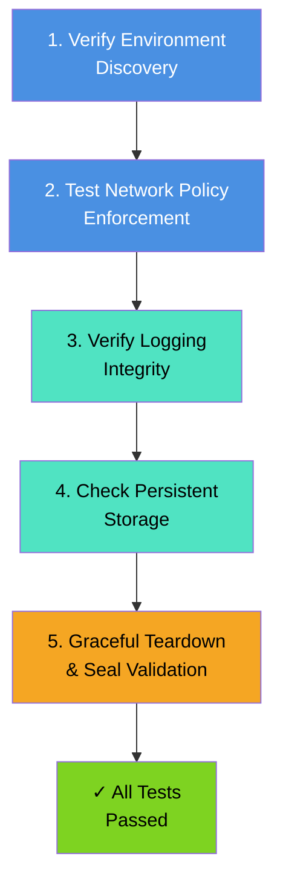

# Verification Guide

Complete testing and validation procedures for N-Audit Sentinel after deployment to Kubernetes.

## Local Testing (Before Deployment)

Run the complete test suite locally to verify functionality:

```bash
# Run all tests (unit + integration)
make test

# Run tests with verbose output
go test ./... -v

# Run only E2E tests
make test-e2e ENV=k3s

# Check test coverage (generate profile)
go test ./... -cover

# Format and lint before committing
make fmt
make lint
```

Test results are organized in:
- `tests/unit/` — Unit tests for individual functions
- `tests/integration/` — Integration tests across packages
- `tests/e2e/k8s/` — End-to-end tests for Kubernetes environments

## Testing Pipeline



## Test 1: Verify Environment Discovery

After the pod starts, confirm that it discovered the Kubernetes API server and DNS resolvers.

### Check pod logs

```bash
kubectl logs n-audit-sentinel
```

**Expected output (in logs):**
```
[N-Audit] Discovered K8s API Server: 10.43.0.1:443
[N-Audit] Discovered DNS Servers: [10.43.0.10]
```

### What's being verified
- Pod can reach the Kubernetes API server
- Pod can discover DNS servers from the cluster
- Logging system is initialized and writing output

**If discovery fails:**
- Pod may not have network access to cluster services
- Check pod's `kubectl logs` for specific errors
- Verify ServiceAccount and RBAC are correctly applied (Test 3)

## Test 2: Verify Network Policy Enforcement (Cilium)

Test that Cilium policies correctly enforce scope boundaries.

### Scenario A: Restricted Scope (Explicit Target)

**Start a session with defined scope:**

```bash
kubectl attach -it n-audit-sentinel -c sentinel
```

**Follow TUI prompts:**
```
Pentester Name: <your-name>
Client Name: <client-name>
[Layer 3] IP/CIDR: 8.8.8.8
(Double Enter)
[Layer 7] Domain: (press Enter twice)
```

**Inside the shell, test policy enforcement:**

```bash
# In-scope should PASS
ping -c 2 8.8.8.8

# Out-of-scope should FAIL
ping -c 2 1.1.1.1

# L7 domain access should FAIL
curl -m 5 -I google.com || echo "curl blocked (expected)"
```

**Expected results:**
- ✓ `ping 8.8.8.8` responds (2/2 packets received)
- ✗ `ping 1.1.1.1` fails (no responses or timeout)
- ✗ `curl google.com` fails or times out (policy blocks)

### Scenario B: Unrestricted Mode (No Scope)

**Start a session without specifying scope:**

```bash
kubectl attach -it n-audit-sentinel -c sentinel
```

**Follow TUI prompts (press Enter through all):**
```
Pentester Name: (press Enter)
Client Name: (press Enter)
[Layer 3] IP/CIDR: (press Enter twice)
[Layer 7] Domain: (press Enter twice)
```

**Check logs for unrestricted mode indicator:**

```bash
kubectl logs n-audit-sentinel --tail=50 | grep -i "unrestricted"
# Expected: message indicating no policy is active
```

**Inside the shell, access should be open:**

```bash
curl -m 5 -I google.com
```

**Expected result:**
- ✓ `curl google.com` succeeds (returns HTTP headers)
- No Cilium policy is enforced

### Debugging Network Policy Issues

```bash
# View applied Cilium policies
kubectl get ciliumnetworkpolicies

# Describe the policy
kubectl describe cnp n-audit-sentinel-policy

# Check Cilium agent logs
kubectl logs -n kube-system -l k8s-app=cilium | grep n-audit
```

## Test 3: Verify Logging Integrity

### Real-time Log Tailing

**From inside the pod:**
```bash
# Execute while session is active
kubectl exec -it n-audit-sentinel -- tail -f /var/lib/n-audit/session.log
```

**From the host (via hostPath):**
```bash
# Execute on the node running the pod
sudo tail -f /mnt/n-audit-data/session.log
```

### Log Format Validation

**Check log structure:**
```bash
kubectl exec n-audit-sentinel -- head -20 /var/lib/n-audit/session.log
```

**Expected log format:**
```
2025-12-11 14:30:45 [Banner] N-Audit Sentinel v1.0.0-Beta
2025-12-11 14:30:45 Pentester: operator
2025-12-11 14:30:45 Client: client-name
2025-12-11 14:30:45 Scope: 8.8.8.8/32
2025-12-11 14:31:00 $ whoami
2025-12-11 14:31:00 root
2025-12-11 14:31:02 $ id
2025-12-11 14:31:02 uid=0(root) gid=0(root) groups=0(root)
```

### Verify ANSI-Free Logging

**Check that logs contain NO escape sequences:**

```bash
# Bad (contains ANSI codes):
# $ grep -E '\x1b\[[0-9;]*m' /var/lib/n-audit/session.log && echo "FAIL: ANSI found"

# Good (no ANSI codes):
kubectl exec n-audit-sentinel -- grep -c $'\x1b' /var/lib/n-audit/session.log
# Expected: 0
```

**All lines must have timestamps:**

```bash
kubectl exec n-audit-sentinel -- \
  awk '!/^[0-9]{4}-[0-9]{2}-[0-9]{2} [0-9]{2}:[0-9]{2}:[0-9]{2}/' \
  /var/lib/n-audit/session.log | wc -l
# Expected: 0 (no lines without timestamps)
```

## Test 4: Persistent Storage (hostPath)

### Verify Log Persistence

Find the node running the pod and inspect the hostPath:

```bash
# Step 1: Find which node is running the pod
kubectl get pod n-audit-sentinel -o wide
# Output shows NODE column

# Step 2: SSH to that node and inspect hostPath
ssh <node-ip>
sudo ls -lah /mnt/n-audit-data/
sudo tail -n 50 /mnt/n-audit-data/session.log
```

**Expected:**
- `/mnt/n-audit-data/` exists and is readable
- `session.log` mirrors the pod's `/var/lib/n-audit/session.log`
- Log content matches real-time operations

### Verify Log Survives Pod Deletion

```bash
# Note the log content
sudo tail -5 /mnt/n-audit-data/session.log > /tmp/session-before.txt

# Delete the pod
kubectl delete pod n-audit-sentinel

# Log still exists on host
sudo tail -5 /mnt/n-audit-data/session.log > /tmp/session-after.txt

# Verify content is identical
diff /tmp/session-before.txt /tmp/session-after.txt
# Expected: no output (files are identical)
```

## Test 5: Graceful Teardown & Cryptographic Seal

### Trigger Graceful Exit

**From another terminal (while session is active):**

```bash
kubectl exec n-audit-sentinel -c sentinel -- /usr/local/bin/n-audit
```

This sends `SIGUSR1` to PID 1, which triggers:
1. Log finalization
2. SHA256 hash computation
3. SSH signature generation
4. FORENSIC SEAL block appended
5. Cilium policy cleanup
6. Pod termination

### Verify FORENSIC SEAL

**Check the final log block:**

```bash
sudo tail -10 /mnt/n-audit-data/session.log
```

**Expected output:**
```
=== FORENSIC SEAL ===
SHA256 Hash: 3a4b5c6d7e8f9a0b1c2d3e4f5a6b7c8d9e0f1a2b3c4d5e6f7a8b9c0d1e2f3a4b5c
SSH Signature (Base64): AAAAC3NzaC1lZDI1NTE5AAAAgOVCblXV2uXY...
=====================
```

### Validate SHA256 Integrity

**Extract content (excluding seal) and compute hash:**

```bash
# Extract all lines before FORENSIC SEAL
awk '/^=== FORENSIC SEAL ===/{exit} {print}' /mnt/n-audit-data/session.log | sha256sum
# Output: <64-char-hex>  -

# Compare with seal value
grep "SHA256 Hash:" /mnt/n-audit-data/session.log
```

**Expected:**
- Computed hash matches the `SHA256 Hash:` value in the seal block

### Optional: Verify SSH Signature

For full cryptographic verification, extract and validate the SSH signature:

```bash
# Extract public key
sudo cat /mnt/n-audit-data/signing/id_ed25519.pub

# Extract signature from seal
SIGNATURE=$(grep "SSH Signature" /mnt/n-audit-data/session.log | cut -d: -f2)

# Verify with ssh-keygen (requires Go helper or custom validation)
# See README.md for signature verification example
```

## Summary: Complete Verification Checklist

- [ ] **Discovery**: K8s API and DNS found in pod logs
- [ ] **Policy Enforcement**: Restricted scope blocks out-of-scope traffic; unrestricted mode allows all
- [ ] **Logging**: All lines have `YYYY-MM-DD HH:MM:SS` timestamps, zero ANSI codes
- [ ] **Persistence**: Log persists on hostPath even after pod deletion
- [ ] **Seal**: FORENSIC SEAL block appended with valid SHA256 hash
- [ ] **Integrity**: Computed SHA256 matches seal value

**If all checks pass, N-Audit Sentinel is functioning correctly.**

## Troubleshooting Tips

| Symptom | Likely Cause | Check |
|---------|--------------|-------|
| No K8s API discovery | Pod network isolation or API unreachable | `kubectl logs n-audit-sentinel` for errors |
| Cilium policy not applied | RBAC missing or Cilium unhealthy | `kubectl get clusterrolebinding` and `kubectl get ciliumnetworkpolicies` |
| ANSI codes in log | Logger not initialized | Check logger initialization in pod logs |
| No seal block | SSH key missing or unreadable | `ls -la /mnt/n-audit-data/signing/id_ed25519` (must be `600`) |
| Hash mismatch | Log modified after seal | Check file permissions and access logs |

## Cross-References

- **[README.md](README.md)** — Architecture and feature overview
- **[DEPLOYMENT.md](DEPLOYMENT.md)** — Complete deployment instructions
- **[SECURITY.md](SECURITY.md)** — Security model and threat analysis

---

## Advanced Verification & Analysis

### eBPF Policy Validation

**Verify Cilium eBPF programs are loaded:**

```bash
# On the node running the pod, check loaded BPF programs
sudo bpftool prog list | grep cilium

# Show detailed BPF program info
sudo bpftool prog show id <PROG_ID> verbose

# Trace policy enforcement in real-time
sudo bpftool prog tracelog
```

**Expected output (for active policy):**
```
xdp_program: cilium_xdp_exit (type: XDP)
tc_program: cilium_tc_ingress (type: TC)
tc_program: cilium_tc_egress (type: TC)
```

### Network Stack Inspection

**Verify policy enforcement at kernel level:**

```bash
# Monitor netfilter connections (if using legacy iptables)
sudo conntrack -L

# Check Cilium agent status
kubectl -n kube-system exec -it cilium-xxx -- cilium status

# View installed policies
kubectl -n kube-system exec -it cilium-xxx -- cilium policy get
```

### Cryptographic Seal Validation (Advanced)

**Manual Ed25519 signature verification:**

```bash
# Extract public key
PUB_KEY=$(cat /mnt/n-audit-data/signing/id_ed25519.pub)

# Extract signature from seal
SIGNATURE=$(grep "SSH Signature" /mnt/n-audit-data/session.log | awk -F': ' '{print $2}')

# Decode base64 signature
echo $SIGNATURE | base64 -d > /tmp/sig.bin

# Extract content before seal
awk '/^=== FORENSIC SEAL ===/{exit}' /mnt/n-audit-data/session.log > /tmp/content.txt

# Compute hash
SHA=$(sha256sum /tmp/content.txt | cut -d' ' -f1)
echo "Computed SHA256: $SHA"

# Compare with seal
SEAL_SHA=$(grep "SHA256 Hash" /mnt/n-audit-data/session.log | awk -F': ' '{print $2}')
echo "Seal SHA256:     $SEAL_SHA"
[ "$SHA" = "$SEAL_SHA" ] && echo "✓ Hash verified" || echo "✗ Hash mismatch"
```

### PTY Emulation Verification

**Verify bash safety loop is functioning:**

```bash
# Inside active session
$ exit    # or Ctrl+D
# Expected: Bash respawns (prompt returns)

$ exit
# Expected: Prompt still present

# To terminate, use:
$ n-audit exit    # From another terminal: kubectl exec ... -- /usr/local/bin/n-audit
```

### Performance Analysis

**Measure policy application latency:**

```bash
# Start time before scope entry
kubectl logs n-audit-sentinel | grep "Apply CNP"

# Policy should apply within <5 seconds
# If > 10 seconds: Check Cilium agent logs, API server latency
```

**Monitor logging throughput:**

```bash
# Measure log file growth
while true; do
  SIZE=$(stat -f%z /mnt/n-audit-data/session.log 2>/dev/null || stat -c%s /mnt/n-audit-data/session.log)
  echo "$(date): $SIZE bytes"
  sleep 1
done

# Expected: 1-50 KB/sec under normal activity
# If > 100 KB/sec: Commands generating excessive output
```

### Cilium Policy Inspection

**Deep-dive into applied policies:**

```bash
# View all CiliumNetworkPolicies
kubectl get cnp -o yaml

# View the specific policy for our pod
kubectl get cnp n-audit-sentinel-policy -o yaml

# Check policy statistics
kubectl exec -it cilium-xxx -n kube-system -- \
  cilium policy get | grep n-audit-sentinel

# Trace specific policy rules in action
kubectl logs -n kube-system cilium-xxx | grep n-audit-sentinel
```

### Forensic Log Analysis

**Extract session statistics:**

```bash
# Command count
awk '/^\[SESSION\]/{next} /^[0-9]{4}-/{count++} END {print "Total lines:", count}' /mnt/n-audit-data/session.log

# Time span
HEAD_TIME=$(head -1 /mnt/n-audit-data/session.log | cut -d' ' -f1-2)
TAIL_TIME=$(awk '/^=== FORENSIC SEAL ===/{exit} 1' /mnt/n-audit-data/session.log | tail -1 | cut -d' ' -f1-2)
echo "Session: $HEAD_TIME → $TAIL_TIME"

# Search for keywords (audit-related)
grep -i "whoami\|id\|sudo\|exec" /mnt/n-audit-data/session.log

# Detect anomalies (no ANSI codes)
grep -c $'\x1b' /mnt/n-audit-data/session.log || echo "✓ No ANSI codes found (clean)"
```

### Troubleshooting Advanced Issues

**Policy enforcement not activating:**
- Check Cilium agent is running: `kubectl -n kube-system get pods | grep cilium`
- Verify pod has `app: n-audit-sentinel` label: `kubectl get pod -L app`
- Check policy syntax: `kubectl get cnp n-audit-sentinel-policy -o yaml`
- Review Cilium agent logs: `kubectl logs -n kube-system -l k8s-app=cilium`

**Seal computation failures:**
- Verify signing key exists and is readable: `ls -la /mnt/n-audit-data/signing/id_ed25519`
- Check key is valid Ed25519: `file /mnt/n-audit-data/signing/id_ed25519`
- Review pod logs for signing errors: `kubectl logs n-audit-sentinel | grep -i signature`

**Log persistence issues:**
- Verify hostPath on node is writable: `sudo touch /mnt/n-audit-data/test.txt`
- Check pod volume mount: `kubectl describe pod n-audit-sentinel | grep -A5 "Mounts:"`
- Review pod filesystem: `kubectl exec -it n-audit-sentinel -- ls -la /var/lib/n-audit/`
