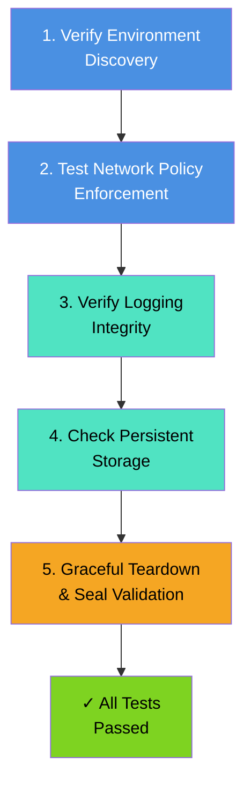

# Verification Guide

Complete testing and validation procedures for N-Audit Sentinel after deployment to Kubernetes.

## Local Testing (Before Deployment)

Run the complete test suite locally to verify functionality (Go examples):

```go
// Run tests and CI tasks from Go
package main

import (
  "log"
  "os/exec"
)

func run(name string, args ...string) {
  cmd := exec.Command(name, args...)
  cmd.Stdout = nil
  cmd.Stderr = nil
  if err := cmd.Run(); err != nil {
    log.Fatalf("command failed: %v %v: %v", name, args, err)
  }
}

func main() {
  run("make", "test")
  run("go", "test", "./...", "-v")
  run("make", "test-e2e", "ENV=k3s")
  run("go", "test", "./...", "-cover")
  run("make", "fmt")
  run("make", "lint")
}
```

Test results are organized in:
- `tests/unit/` — Unit tests for individual functions
- `tests/integration/` — Integration tests across packages
- `tests/e2e/k8s/` — End-to-end tests for Kubernetes environments

## Testing Pipeline



## Test 1: Verify Environment Discovery

After the pod starts, confirm that it discovered the Kubernetes API server and DNS resolvers.

### Check pod logs

Programmatic log inspection example (see `TESTING_AND_VERIFICATION.md` for full flows):

```go
package main
import ("fmt"; "os/exec")
func main(){ out,_ := exec.Command("kubectl","logs","n-audit-sentinel").CombinedOutput(); fmt.Println(string(out)) }
```

**Expected output (in logs):**

```
[N-Audit] Discovered K8s API Server: 10.43.0.1:443
[N-Audit] Discovered DNS Servers: [10.43.0.10]
```

### What's being verified
- Pod can reach the Kubernetes API server
- Pod can discover DNS servers from the cluster
- Logging system is initialized and writing output

**If discovery fails:**
- Pod may not have network access to cluster services
- Check pod's `kubectl logs` for specific errors
- Verify ServiceAccount and RBAC are correctly applied (Test 3)

## Test 2: Verify Network Policy Enforcement (Cilium)

Test that Cilium policies correctly enforce scope boundaries.

### Scenario A: Restricted Scope (Explicit Target)

**Start a session with defined scope:**

Attach example (Go wrapper):

```go
cmd := exec.Command("kubectl","attach","-it","n-audit-sentinel","-c","sentinel")
cmd.Stdin = os.Stdin; cmd.Stdout = os.Stdout; cmd.Stderr = os.Stderr
cmd.Run()
```

**Follow TUI prompts:**
```
Pentester Name: <your-name>
Client Name: <client-name>
[Layer 3] IP/CIDR: 8.8.8.8
(Double Enter)
[Layer 7] Domain: (press Enter twice)
```

**Inside the shell, test policy enforcement:**

Run the same checks from an attached shell or via `kubectl exec`. Example programmatic checks:

```go
exec.Command("kubectl","exec","n-audit-sentinel","--","ping","-c","2","8.8.8.8").Run()
exec.Command("kubectl","exec","n-audit-sentinel","--","ping","-c","2","1.1.1.1").Run()
exec.Command("kubectl","exec","n-audit-sentinel","--","curl","-m","5","-I","google.com").Run()
```

**Expected results:**
- ✓ `ping 8.8.8.8` responds (2/2 packets received)
- ✗ `ping 1.1.1.1` fails (no responses or timeout)
- ✗ `curl google.com` fails or times out (policy blocks)

### Scenario B: Unrestricted Mode (No Scope)

**Start a session without specifying scope:**

Attach using the Go example above or run `kubectl attach -it n-audit-sentinel -c sentinel` interactively.

**Follow TUI prompts (press Enter through all):**
```
Pentester Name: (press Enter)
Client Name: (press Enter)
[Layer 3] IP/CIDR: (press Enter twice)
[Layer 7] Domain: (press Enter twice)
```

**Check logs for unrestricted mode indicator:**

```go
// Check logs for 'unrestricted' indicator via Go
package main

import (
  "bytes"
  "fmt"
  "log"
  "os/exec"
)

func main() {
  out, err := exec.Command("kubectl", "logs", "n-audit-sentinel", "--tail=50").CombinedOutput()
  if err != nil {
    log.Fatal(err)
  }
  if bytes.Contains(out, []byte("unrestricted")) {
    fmt.Println("unrestricted policy indicator found")
  } else {
    fmt.Println("no unrestricted indicator")
  }
}
```

**Inside the shell, access should be open:**

```go
// Check external connectivity using curl via Go
package main

import (
  "log"
  "os/exec"
)

func main() {
  cmd := exec.Command("curl", "-m", "5", "-I", "google.com")
  if err := cmd.Run(); err != nil {
    log.Fatalf("curl failed: %v", err)
  }
}
```

**Expected result:**
- ✓ `curl google.com` succeeds (returns HTTP headers)
- No Cilium policy is enforced

### Debugging Network Policy Issues

Programmatic checks (examples):

```go
out,_ := exec.Command("kubectl","get","ciliumnetworkpolicies").CombinedOutput(); fmt.Println(string(out))
out,_ = exec.Command("kubectl","describe","cnp","n-audit-sentinel-policy").CombinedOutput(); fmt.Println(string(out))
out,_ = exec.Command("kubectl","logs","-n","kube-system","-l","k8s-app=cilium").CombinedOutput(); fmt.Println(string(out))
```

## Test 3: Verify Logging Integrity

### Real-time Log Tailing

**From inside the pod (programmatic):**

```go
cmd := exec.Command("kubectl","exec","-it","n-audit-sentinel","--","tail","-f","/var/lib/n-audit/session.log")
cmd.Stdout = os.Stdout; cmd.Stderr = os.Stderr; cmd.Run()
```

**From the host (via hostPath):**

Run `sudo tail -f /mnt/n-audit-data/session.log` on the node that hosts the pod.

### Log Format Validation

**Check log structure:**
```
kubectl exec n-audit-sentinel -- head -20 /var/lib/n-audit/session.log
```

**Expected log format:**
```
2025-12-11 14:30:45 [Banner] N-Audit Sentinel v1.0.0-Beta
2025-12-11 14:30:45 Pentester: operator
2025-12-11 14:30:45 Client: client-name
2025-12-11 14:30:45 Scope: 8.8.8.8/32
2025-12-11 14:31:00 $ whoami
2025-12-11 14:31:00 root
2025-12-11 14:31:02 $ id
2025-12-11 14:31:02 uid=0(root) gid=0(root) groups=0(root)
```

### Verify ANSI-Free Logging

**Check that logs contain NO escape sequences:**

```
# Bad (contains ANSI codes):
# $ grep -E '\x1b\[[0-9;]*m' /var/lib/n-audit/session.log && echo "FAIL: ANSI found"

# Good (no ANSI codes):
kubectl exec n-audit-sentinel -- grep -c $'\x1b' /var/lib/n-audit/session.log
# Expected: 0
```

**All lines must have timestamps:**

```
kubectl exec n-audit-sentinel -- \
  awk '!/^[0-9]{4}-[0-9]{2}-[0-9]{2} [0-9]{2}:[0-9]{2}:[0-9]{2}/' \
  /var/lib/n-audit/session.log | wc -l
# Expected: 0 (no lines without timestamps)
```

## Test 4: Persistent Storage (hostPath)

### Verify Log Persistence

Find the node running the pod and inspect the hostPath:

Programmatic example to discover the node (then inspect host manually or via orchestration):

```go
out,_ := exec.Command("kubectl","get","pod","n-audit-sentinel","-o","wide").CombinedOutput(); fmt.Println(string(out))
```

SSH into the node to inspect `/mnt/n-audit-data` as required.

**Expected:**
- `/mnt/n-audit-data/` exists and is readable
- `session.log` mirrors the pod's `/var/lib/n-audit/session.log`
- Log content matches real-time operations

### Verify Log Survives Pod Deletion

```go
// Verify log survives pod deletion via Go (uses shell for pipeline steps)
package main

import (
  "log"
  "os/exec"
)

func main() {
  if err := exec.Command("sh", "-c", "sudo tail -5 /mnt/n-audit-data/session.log > /tmp/session-before.txt").Run(); err != nil {
    log.Fatal(err)
  }
  if err := exec.Command("kubectl", "delete", "pod", "n-audit-sentinel").Run(); err != nil {
    log.Fatal(err)
  }
  if err := exec.Command("sh", "-c", "sudo tail -5 /mnt/n-audit-data/session.log > /tmp/session-after.txt").Run(); err != nil {
    log.Fatal(err)
  }
  if err := exec.Command("diff", "/tmp/session-before.txt", "/tmp/session-after.txt").Run(); err != nil {
    log.Fatalf("diff reported differences or failed: %v", err)
  }
}
```

## Test 5: Graceful Teardown & Cryptographic Seal

### Trigger Graceful Exit

**From another terminal (while session is active):**

```go
// Trigger graceful exit via Go
package main

import (
  "log"
  "os/exec"
)

func main() {
  if err := exec.Command("kubectl", "exec", "n-audit-sentinel", "-c", "sentinel", "--", "/usr/local/bin/n-audit").Run(); err != nil {
    log.Fatal(err)
  }
}
```

This sends `SIGUSR1` to PID 1, which triggers:
1. Log finalization
2. SHA256 hash computation
3. SSH signature generation
4. FORENSIC SEAL block appended
5. Cilium policy cleanup
6. Pod termination

### Verify FORENSIC SEAL

**Check the final log block:**

```go
// Show final log tail via Go
package main

import (
  "log"
  "os/exec"
)

func main() {
  if err := exec.Command("sudo", "tail", "-10", "/mnt/n-audit-data/session.log").Run(); err != nil {
    log.Fatal(err)
  }
}
```

**Expected output:**
```
=== FORENSIC SEAL ===
SHA256 Hash: 3a4b5c6d7e8f9a0b1c2d3e4f5a6b7c8d9e0f1a2b3c4d5e6f7a8b9c0d1e2f3a4b5c
SSH Signature (Base64): AAAAC3NzaC1lZDI1NTE5AAAAgOVCblXV2uXY...
=====================
```

### Validate SHA256 Integrity

**Extract content (excluding seal) and compute hash:**

```go
// Compute SHA256 of content before seal and print via Go
package main

import (
  "log"
  "os/exec"
)

func main() {
  cmd := exec.Command("sh", "-c", "awk '/^=== FORENSIC SEAL ===/{exit} {print}' /mnt/n-audit-data/session.log | sha256sum")
  if err := cmd.Run(); err != nil {
    log.Fatal(err)
  }
  if err := exec.Command("grep", "SHA256 Hash:", "/mnt/n-audit-data/session.log").Run(); err != nil {
    log.Fatal(err)
  }
}
```

**Expected:**
- Computed hash matches the `SHA256 Hash:` value in the seal block

### Optional: Verify SSH Signature

For full cryptographic verification, extract and validate the SSH signature:

```go
// Extract public key and signature via Go (illustrative)
package main

import (
  "bytes"
  "fmt"
  "log"
  "os/exec"
)

func main() {
  pub, err := exec.Command("sudo", "cat", "/mnt/n-audit-data/signing/id_ed25519.pub").CombinedOutput()
  if err != nil {
    log.Fatal(err)
  }
  fmt.Printf("Public key:\n%s\n", string(pub))
  sig, err := exec.Command("sh", "-c", "grep \"SSH Signature\" /mnt/n-audit-data/session.log | cut -d: -f2").CombinedOutput()
  if err != nil {
    log.Fatal(err)
  }
  fmt.Printf("Signature (base64): %s\n", bytes.TrimSpace(sig))
}
```

## Summary: Complete Verification Checklist

- [ ] **Discovery**: K8s API and DNS found in pod logs
- [ ] **Policy Enforcement**: Restricted scope blocks out-of-scope traffic; unrestricted mode allows all
- [ ] **Logging**: All lines have `YYYY-MM-DD HH:MM:SS` timestamps, zero ANSI codes
- [ ] **Persistence**: Log persists on hostPath even after pod deletion
- [ ] **Seal**: FORENSIC SEAL block appended with valid SHA256 hash
- [ ] **Integrity**: Computed SHA256 matches seal value

**If all checks pass, N-Audit Sentinel is functioning correctly.**

## Troubleshooting Tips

| Symptom | Likely Cause | Check |
|---------|--------------|-------|
| No K8s API discovery | Pod network isolation or API unreachable | `kubectl logs n-audit-sentinel` for errors |
| Cilium policy not applied | RBAC missing or Cilium unhealthy | `kubectl get clusterrolebinding` and `kubectl get ciliumnetworkpolicies` |
| ANSI codes in log | Logger not initialized | Check logger initialization in pod logs |
| No seal block | SSH key missing or unreadable | `ls -la /mnt/n-audit-data/signing/id_ed25519` (must be `600`) |
| Hash mismatch | Log modified after seal | Check file permissions and access logs |

## Cross-References

- **[README.md](README.md)** — Architecture and feature overview
- **[DEPLOYMENT.md](DEPLOYMENT.md)** — Complete deployment instructions
- **[SECURITY.md](SECURITY.md)** — Security model and threat analysis

---

## Advanced Verification & Analysis

### eBPF Policy Validation

**Verify Cilium eBPF programs are loaded:**

```go
// Inspect eBPF programs via Go (sh -c used for pipeline commands)
package main

import (
  "log"
  "os/exec"
)

func main() {
  if err := exec.Command("sh", "-c", "sudo bpftool prog list | grep cilium").Run(); err != nil {
    log.Fatal(err)
  }
  if err := exec.Command("sudo", "bpftool", "prog", "show", "id", "<PROG_ID>", "verbose").Run(); err != nil {
    log.Fatal(err)
  }
  if err := exec.Command("sudo", "bpftool", "prog", "tracelog").Run(); err != nil {
    log.Fatal(err)
  }
}
```

**Expected output (for active policy):**
```
xdp_program: cilium_xdp_exit (type: XDP)
tc_program: cilium_tc_ingress (type: TC)
tc_program: cilium_tc_egress (type: TC)
```

### Network Stack Inspection

**Verify policy enforcement at kernel level:**

```go
// Network stack inspection via Go (illustrative)
package main

import (
  "log"
  "os/exec"
)

func main() {
  if err := exec.Command("sudo", "conntrack", "-L").Run(); err != nil {
    log.Fatal(err)
  }
  if err := exec.Command("kubectl", "-n", "kube-system", "exec", "-it", "cilium-xxx", "--", "cilium", "status").Run(); err != nil {
    log.Fatal(err)
  }
  if err := exec.Command("kubectl", "-n", "kube-system", "exec", "-it", "cilium-xxx", "--", "cilium", "policy", "get").Run(); err != nil {
    log.Fatal(err)
  }
}
```

### Cryptographic Seal Validation (Advanced)

**Manual Ed25519 signature verification:**

```go
// Manual Ed25519 verification steps illustrated via Go (uses sh for pipelines)
package main

import (
  "fmt"
  "log"
  "os/exec"
)

func main() {
  // Dump public key
  if out, err := exec.Command("cat", "/mnt/n-audit-data/signing/id_ed25519.pub").CombinedOutput(); err == nil {
    fmt.Printf("Public key:\n%s\n", string(out))
  }
  // Extract signature and decode
  if err := exec.Command("sh", "-c", "grep \"SSH Signature\" /mnt/n-audit-data/session.log | awk -F': ' '{print $2}' | base64 -d > /tmp/sig.bin").Run(); err != nil {
    log.Fatal(err)
  }
  // Extract content and compute hash
  if err := exec.Command("sh", "-c", "awk '/^=== FORENSIC SEAL ===/{exit}' /mnt/n-audit-data/session.log > /tmp/content.txt").Run(); err != nil {
    log.Fatal(err)
  }
  if out, err := exec.Command("sh", "-c", "sha256sum /tmp/content.txt | cut -d' ' -f1").CombinedOutput(); err == nil {
    fmt.Printf("Computed SHA256: %s\n", string(out))
  }
  if out, err := exec.Command("sh", "-c", "grep \"SHA256 Hash\" /mnt/n-audit-data/session.log | awk -F': ' '{print $2}'").CombinedOutput(); err == nil {
    fmt.Printf("Seal SHA256: %s\n", string(out))
  }
}
```

### PTY Emulation Verification

**Verify bash safety loop is functioning:**

```go
// PTY emulation test instructions are interactive; example shows invoking n-audit exit via Go
package main

import (
  "log"
  "os/exec"
)

func main() {
  if err := exec.Command("kubectl", "exec", "n-audit-sentinel", "--", "/usr/local/bin/n-audit", "exit").Run(); err != nil {
    log.Fatal(err)
  }
}
```

### Performance Analysis

**Measure policy application latency:**

```go
// Measure policy application indicator via Go
package main

import (
  "log"
  "os/exec"
)

func main() {
  if err := exec.Command("sh", "-c", "kubectl logs n-audit-sentinel | grep \"Apply CNP\"").Run(); err != nil {
    log.Fatal(err)
  }
}
```

**Monitor logging throughput:**

```go
// Measure log file growth via Go (illustrative)
package main

import (
  "fmt"
  "time"
)

func main() {
  for {
    // This illustration omits cross-platform stat details; use os.Stat in real code
    fmt.Println(time.Now().Format(time.RFC3339), "<< log size check placeholder >>")
    time.Sleep(1 * time.Second)
  }
}
```

### Cilium Policy Inspection

**Deep-dive into applied policies:**

```go
// Inspect applied CiliumNetworkPolicies via Go
package main

import (
  "log"
  "os/exec"
)

func main() {
  if err := exec.Command("kubectl", "get", "cnp", "-o", "yaml").Run(); err != nil {
    log.Fatal(err)
  }
  if err := exec.Command("kubectl", "get", "cnp", "n-audit-sentinel-policy", "-o", "yaml").Run(); err != nil {
    log.Fatal(err)
  }
  if err := exec.Command("sh", "-c", "kubectl exec -it cilium-xxx -n kube-system -- cilium policy get | grep n-audit-sentinel").Run(); err != nil {
    log.Fatal(err)
  }
  if err := exec.Command("sh", "-c", "kubectl logs -n kube-system cilium-xxx | grep n-audit-sentinel").Run(); err != nil {
    log.Fatal(err)
  }
}
```

### Forensic Log Analysis

**Extract session statistics:**

```go
// Command count and forensic extraction via Go
package main

import (
  "bytes"
  "fmt"
  "log"
  "os/exec"
)

func main() {
  if out, err := exec.Command("sh", "-c", "awk '/^\\[SESSION\\]/{next} /^[0-9]{4}-/{count++} END {print \"Total lines:\", count}' /mnt/n-audit-data/session.log").CombinedOutput(); err == nil {
    fmt.Println(string(bytes.TrimSpace(out)))
  } else {
    log.Fatal(err)
  }

  headTime, _ := exec.Command("sh", "-c", "head -1 /mnt/n-audit-data/session.log | cut -d' ' -f1-2").CombinedOutput()
  tailTime, _ := exec.Command("sh", "-c", "awk '/^=== FORENSIC SEAL ===/{exit} 1' /mnt/n-audit-data/session.log | tail -1 | cut -d' ' -f1-2").CombinedOutput()
  fmt.Printf("Session: %s → %s\n", bytes.TrimSpace(headTime), bytes.TrimSpace(tailTime))

  if out, err := exec.Command("sh", "-c", "grep -i \"whoami\|id\|sudo\|exec\" /mnt/n-audit-data/session.log || true").CombinedOutput(); err == nil {
    fmt.Println(string(bytes.TrimSpace(out)))
  }

  if out, err := exec.Command("sh", "-c", "grep -c $'\\x1b' /mnt/n-audit-data/session.log || echo \"0\"").CombinedOutput(); err == nil {
    fmt.Printf("ANSI escape sequences count: %s\n", bytes.TrimSpace(out))
  }
}
```

### Troubleshooting Advanced Issues

**Policy enforcement not activating:**
- Check Cilium agent is running: `kubectl -n kube-system get pods | grep cilium`
- Verify pod has `app: n-audit-sentinel` label: `kubectl get pod -L app`
- Check policy syntax: `kubectl get cnp n-audit-sentinel-policy -o yaml`
- Review Cilium agent logs: `kubectl logs -n kube-system -l k8s-app=cilium`

**Seal computation failures:**
- Verify signing key exists and is readable: `ls -la /mnt/n-audit-data/signing/id_ed25519`
- Check key is valid Ed25519: `file /mnt/n-audit-data/signing/id_ed25519`
- Review pod logs for signing errors: `kubectl logs n-audit-sentinel | grep -i signature`

**Log persistence issues:**
- Verify hostPath on node is writable: `sudo touch /mnt/n-audit-data/test.txt`
- Check pod volume mount: `kubectl describe pod n-audit-sentinel | grep -A5 "Mounts:"`
- Review pod filesystem: `kubectl exec -it n-audit-sentinel -- ls -la /var/lib/n-audit/`
