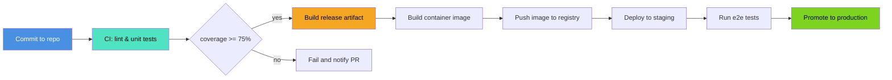
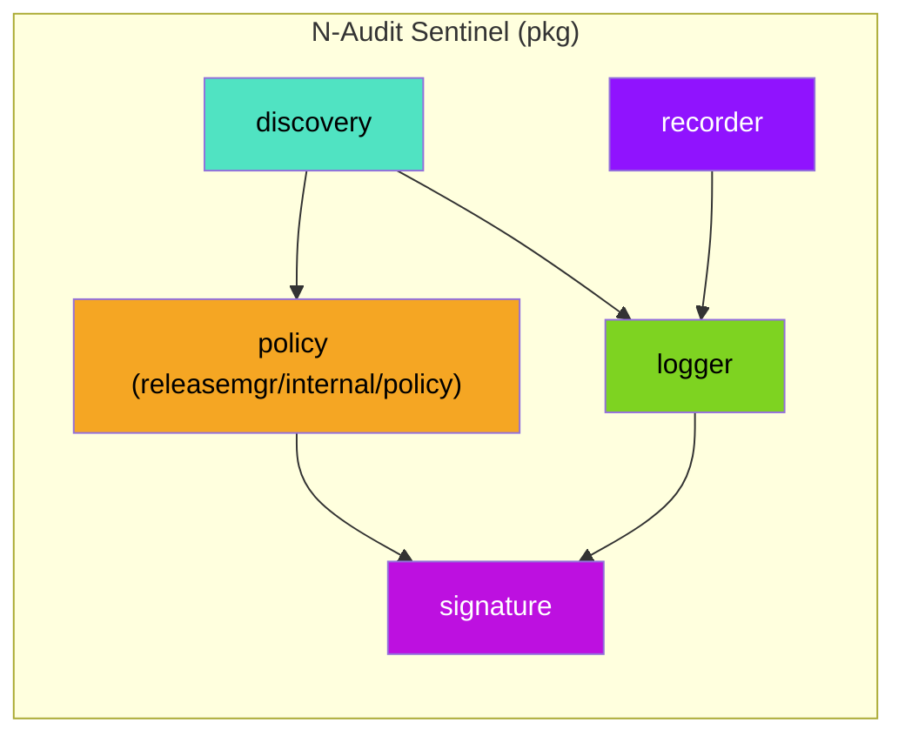
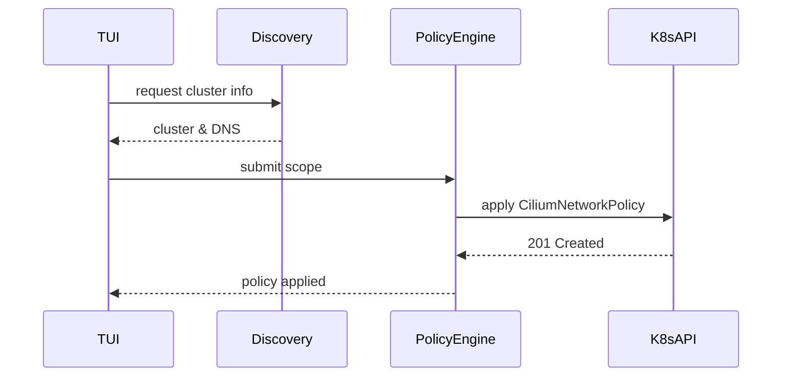
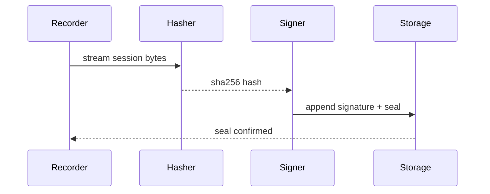

# Architecture Diagrams

This document aggregates additional Mermaid diagrams for architecture, CI/CD, and internal package flows.

## CI/CD Pipeline

## Package Data Flow (Discovery → Policy → Enforcement)

## Policy Generation Sequence

## Forensic Seal Creation (Session End)

