# Enterprise-Grade Architecture Diagrams

Comprehensive system architecture with deployment flows, policy enforcement, and monitoring patterns.

---

## 1. Kubernetes Workload Deployment Architecture

High-level deployment topology with N-Audit Sentinel integrations across multiple zones.

---

## 2. Cilium Network Policy Enforcement Flow

Detailed policy enforcement lifecycle from pod communication to packet filtering.

---

## 3. TUI (Terminal UI) State Machine

Interactive menu system and terminal state transitions for n-audit-cli.

---

## 4. Integration Test Execution Flow

Multi-stage test orchestration with cleanup and verification phases.

---

## 5. Error Handling & Recovery Pipeline

Fault tolerance patterns with automatic recovery, notification, and incident tracking.

```mermaid
graph TD
    A["Service/Pod Error<br/>Detected"] --> B["Error Severity<br/>Classifier"]
    
    B --> C{Severity<br/>Level?}
    
    C -->|CRITICAL| D["🔴 Critical Path"]
    C -->|HIGH| E["🟠 High Path"]
    C -->|MEDIUM| F["🟡 Medium Path"]
    C -->|LOW| G["🔵 Low Path"]
    
    D --> D1["Immediate Failover<br/>to standby"]
    D --> D2["Alert: PagerDuty"]
    D --> D3["Log to etcd"]
    D1 --> H{Recovery<br/>Successful?}
    D2 --> H
    D3 --> H
    
    E --> E1["Retry with backoff<br/>2s, 4s, 8s"]
    E --> E2["Alert: Slack"]
    E1 --> I{Max Retries?}
    E2 --> I
    
    F --> F1["Log event<br/>& monitor"]
    F --> F2["Schedule review<br/>next 24h"]
    F1 --> J["Escalate if<br/>persists"]
    F2 --> J
    
    G --> G1["Debug log only"]
    G1 --> K["Track in<br/>metrics"]
    
    H -->|Yes| L["✅ Recovered"]
    H -->|No| M["Manual review<br/>required"]
    I -->|Yes| M
    I -->|No| N["Graceful degrade"]
    J --> O["On-call review"]
    K --> L
    M --> O
    N --> O
    O --> P["Post-incident<br/>analysis"]
    P --> Q{Root Cause<br/>Found?}
    Q -->|Yes| R["Code patch<br/>released"]
    Q -->|No| S["Continue<br/>monitoring"]
    R --> T["✅ Closed"]
    S --> T
    
    style D fill:#d32f2f,color:#fff,stroke-width:3px
    style E fill:#f57c00,color:#fff,stroke-width:2px
    style F fill:#fbc02d,color:#fff,stroke-width:2px
    style G fill:#1976d2,color:#fff,stroke-width:2px
    style L fill:#388e3c,color:#fff
    style T fill:#388e3c,color:#fff
```

---

## Summary

These diagrams represent **enterprise-grade system design** with:

- **Scalability**: Multi-zone deployment, horizontal pod scaling, load balancing
- **Security**: Network policy enforcement, signature verification, RBAC
- **Observability**: Metrics, logs, traces, and incident tracking
- **Reliability**: Error handling, automatic recovery, failover mechanisms
- **Maintainability**: Clear state transitions, well-defined interfaces, comprehensive testing

Each diagram is designed to be **technically accurate, visually clear, and immediately usable** for architecture reviews, onboarding, and system documentation.
